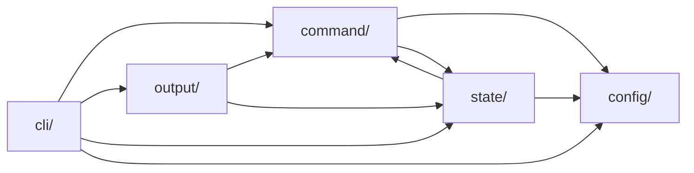

# アーキテクチャ概要

pyfltrの実装構造と主要な設計判断をまとめる。
本ページは保守・拡張に携わる開発者向け。
利用者向けの機能解説は[CLIコマンド](../guide/usage.md)・[設定項目](../guide/configuration.md)を参照する。

## 実行パイプライン

`pyfltr.cli.pipeline.run_pipeline()`がCLI/MCPの双方から呼び出される最上位エントリ。
TUI/非TUIの分岐はこの関数の内側で行い、パイプライン共通の前処理（ファイル展開・`--only-failed`フィルタリング・
アーカイブ初期化など）はTUI起動より前に集約する。

実行ステージは次の3段で構成する。

1. fixステージ — `{command}-fix-args`が定義された有効なlinterを順次`--fix`付きで実行する（`ci`サブコマンドは無効）
2. formatterステージ — `ruff-format`・`prettier`等のformatterを直列または並列で実行する
3. linter/testerステージ — 残りのlinter/testerを並列実行する

各ステージの結果は`CommandResult`に集約され、ステージ完了ごとに`archive_hook`へ渡される。
ステージ間の中断（`--fail-fast`時の打ち切りなど）は`stage_runner`の共通ヘルパーで吸収する。

## モジュール構成 {#modules}

pyfltrのソースコードは`pyfltr/`直下に5つのサブパッケージと少数のトップレベルモジュールで構成する。
各サブパッケージは責務別に分離し、命名は責務に沿う。
ガイダンス系（`precommit_guidance`等）は`cli`配下、実行系は`command`配下に置く。

`__init__.py`ではre-exportせず、利用側はサブパッケージ内の具体モジュールから直接importする。
pyfltrはCLIツールであり、Pythonモジュールパスは内部実装として扱う。
内部リファクタリングではPython API互換性を維持しない。

### サブパッケージ

- `pyfltr/cli/`: CLIエントリポイントと各サブコマンドのハンドラー
    - `cli/main.py`: `main()` / `run()`。エントリポイントとサブコマンドdispatch
    - `cli/parser.py`: `build_parser()` / `make_common_parent()`。argparse構築
    - `cli/pipeline.py`: `run_impl()` / `run_pipeline()` / `run_commands_with_cli()`。パイプライン本体
    - `cli/render.py`: `render_results()` / `write_log()`。text整形描画。`output/formatters.py`から呼ばれる
    - `cli/output_format.py`: `resolve_output_format()` / `text_logger` / `structured_logger`。出力形式解決とログ設定
    - `cli/command_info.py`: `command-info`サブコマンド
    - `cli/config_subcmd.py`: `config`サブコマンド
    - `cli/shell_completion.py`: `generate-shell-completion`サブコマンド
    - `cli/mcp_server.py`: `mcp`サブコマンド（MCPサーバー）
    - `cli/grep_subcmd.py`: `grep`サブコマンド（横断検索のCLI層）
    - `cli/replace_subcmd.py`: `replace`サブコマンド（横断置換・履歴管理・undoのCLI層）
    - `cli/precommit_guidance.py`: pre-commit統合ガイダンス
- `pyfltr/command/`: コマンド実行コア
    - `command/core_.py`: `ExecutionBaseContext` / `ExecutionContext` / `CommandResult` / `CacheContext` /
      `ExecutionParams`。実行コンテキスト型
    - `command/process.py`: `ProcessRegistry` / `run_subprocess` / `terminate_active_processes`。プロセス管理
    - `command/mise.py`: `MiseActiveToolsResult` / `get_mise_active_tools`。mise統合
    - `command/env.py`: `dedupe_environ_path` / `build_subprocess_env`。subprocess環境構築
    - `command/runner.py`: `_BIN_TOOL_SPEC` / `PYTHON_TOOL_BIN` / `build_commandline` /
    `build_invocation_argv` / 各ツールの可用性を判定する関数群（`@functools.lru_cache(maxsize=1)`付き）。
    runner解決とコマンドライン構築
    - `command/targets.py`: `expand_all_files` / `filter_by_globs` / `filter_by_changed_since` / `excluded`。対象ファイル選定
    - `command/snapshot.py`: `snapshot_file_digests` / `changed_files`。ファイル変更検知
    - `command/dispatcher.py`: `execute_command`。ディスパッチャー
    - `command/glab.py`: `execute_glab_ci_lint`。glab関連
    - `command/precommit.py`: `execute_pre_commit`。pre-commit実行
    - `command/linter_fix.py`: `execute_linter_fix`。fixモードでのlinter実行
    - `command/textlint_fix.py`: `execute_textlint_fix`。textlintのfixモード実行
    - `command/builtin.py`: `BUILTIN_COMMANDS` / `CommandInfo`。ビルトインコマンド定義
    - `command/error_parser.py`: `ErrorLocation` / `parse_errors`。エラーパーサー
    - `command/two_step/base.py`: `execute_ruff_format_two_step` / `execute_check_write_two_step` /
    `execute_prettier_two_step` / 各種共通基底ヘルパー。段階制御パイプラインの本体
    - `command/two_step/ruff.py`: `execute_ruff_format_two_step`のエイリアス（base.pyへ委譲）
    - `command/two_step/taplo.py`: `execute_taplo_two_step`のエイリアス（base.pyへ委譲）
    - `command/two_step/shfmt.py`: `execute_shfmt_two_step`のエイリアス（base.pyへ委譲）
    - `command/two_step/prettier.py`: `execute_prettier_two_step`のエイリアス（base.pyへ委譲）
- `pyfltr/config/`: 設定読み書きとプリセット
    - `config/config.py`: `Config` / `load_config()`等。設定の読み書き・解決。
    `BUILTIN_COMMANDS`等のビルトインツール定義の実体は`command/builtin.py`が持つが、
    `config/config.py`内のロジックでも参照するため`from pyfltr.command.builtin import ...`で取り込みつつ、
    `pyfltr.config.config.BUILTIN_COMMANDS`として参照する利用側コード（`cli/parser.py`・テスト群）の
    便宜のため`__all__`にも含めて再エクスポート扱いとする
    - `config/presets.py`: プリセット定義
- `pyfltr/output/`: 出力フォーマット群
    - `output/formatters.py`: `RunOutputContext` / `FORMATTERS`レジストリ。フォーマット基盤
    - `output/jsonl.py`: JSONL出力（`--output-format=jsonl`）
    - `output/sarif.py`: SARIF出力（`--output-format=sarif`）
    - `output/code_quality.py`: GitLab Code Quality出力
    - `output/github_annotations.py`: GitHub Annotations出力
    - `output/ui.py`: Textual UI（`--ui`）
    - `output/rule_urls.py`: ツール別ルールURL生成
- `pyfltr/grep_/`: 横断検索・置換のコアロジック
    - `grep_/matcher.py`: パターンコンパイル（正規表現・固定文字列・smart-case・単語境界・行全体・マルチライン）
    - `grep_/scanner.py`: ファイル走査・マッチ抽出・前後コンテキスト
    - `grep_/replacer.py`: 置換適用ロジック（`re.sub`互換、ハッシュ計算）
    - `grep_/history.py`: replace履歴の世代管理（ULID採番・3軸自動クリーンアップ・undo）
    - `grep_/jsonl_records.py`: grep / replace固有のJSONLレコード生成
    - `grep_/text_render.py`: text形式時の人間向け出力（マッチ表示・差分表示）
    - `grep_/types.py`: grep / replace共通のデータクラス
- `pyfltr/state/`: アーカイブ・キャッシュ・履歴・再実行制御の永続化系
    - `state/archive.py`: 実行アーカイブ読み書き
    - `state/cache.py`: ファイルhashキャッシュ
    - `state/runs.py`: `list-runs` / `show-run`サブコマンド
    - `state/only_failed.py`: `--only-failed`フィルター処理
    - `state/retry.py`: `retry_command`生成
    - `state/executor.py`: コマンド実行順制御
    - `state/stage_runner.py`: ステージ実行ヘルパー

### トップレベルモジュール

- `pyfltr/paths.py`: パスユーティリティ
- `pyfltr/warnings_.py`: 警告蓄積

### サブパッケージ間依存

サブパッケージ追加・モジュール移動の際の判断材料として、主要な依存方向を示す。
矢印は「import元 → import先」を示し、テスト・トップレベル汎用モジュール（`paths`・`warnings_`）への参照は省略する。

`output`と`state`は実行結果である`CommandResult`を扱うために`command/core_`を参照する。
`state`は`command/targets`の`filter_by_globs`等も参照する。
逆方向（`command` → `output` / `state`の参照）は循環を避けるため発生させない。
新規サブパッケージを追加する場合はこの方向ルールに従う。

## サブコマンドとargparse

argparse subparsers（`required=True`）でサブコマンドを必須化し、引数なし実行時のフォールバック挙動は持たない。
共通オプションは`parents=[common]`で各サブパーサーへ継承する。
サブコマンド別の既定値（`exit_zero_even_if_formatted`・`commands`・`output_format`・`include_fix_stage`）は
`_apply_subcommand_defaults()`で手動注入する。
`set_defaults()`経由の注入を避けたのは、共通親パーサーを継承しているサブパーサーに対して
他サブパーサーのdefaultが書き換わる既知挙動を回避するため。

サブコマンド一覧と用途は[CLIコマンド](../guide/usage.md)を参照。

## 主要な設計判断

### 言語カテゴリはゲートとして働く

`python` / `javascript` / `rust` / `dotnet`の各言語カテゴリに属するツールは既定で無効（カテゴリキーが既定`false`）。
対象外プロジェクトで意図しないツール実行が起こることを避けるため、対応する言語カテゴリキー（例: `python = true`）で
ゲートを開けるか、`{command} = true`の個別明示が必要。

プリセットは各時点の推奨ツール構成を示すスナップショットで言語別ツールも含むが、
カテゴリキーが`false`のままだとプリセット由来の該当ツール`true`はゲート処理で`false`に上書きされる。
個別`{command} = true`はゲートを越えて最優先される。
Python系ツール一式は本体依存に同梱されており、`uvx pyfltr`単発で利用できる。
JavaScript / Rust / .NET系は各言語のツールチェイン（Node.js・cargo・dotnet CLI）が前提のため、
pyfltr本体はこれらの依存を抱えない。

代替案として「完全別パッケージ（`pyfltr-python`）に分離」も検討したが、リポジトリ・リリース・バージョン整合の
複雑度が増し、利用者体験も劣るため不採用とした。

### 必須依存は最小化

本体必須依存は次の役割に限定する。

- 骨組み: `textual`（TUI）・`natsort`（自然順ソート）・`pyyaml`（pre-commit設定）
- run_id生成: `python-ulid`
- MCP同梱: `mcp`・`platformdirs`
- プロセス判定: `psutil`（`git commit`経由起動を親系列で検出してMM状態ガイダンスを出力する用途）

`mcp`を本体必須に含めるのはサーバー同梱体験（`pyfltr mcp`が即座に起動できる）を保つため。

### subprocess実行はPopen一本化

subprocess起動は`subprocess.Popen`ベースに統一する。
`--fail-fast`の中断処理（外部スレッドからの`terminate()`呼び出し）が成立する基盤として必要。
パイプライン外で動く`mise --version`・`git check-ignore`・`cls`/`clear`はこの方針の対象外とする。

### `cli/pipeline.py`/`output/ui.py`の共通化はヘルパーに限定する

`cli/pipeline.py`は直接呼び出し、`output/ui.py`はRich UIへの`call_from_thread`埋め込みという構造差がある。
完全共通化はlock取得タイミング差で実装が複雑になるため、共通化は`state/stage_runner.py`の小さなヘルパーへの抽出に留める。
残余重複は`# pylint: disable=duplicate-code`を理由コメント付きで維持する。

### ツール解決の失敗扱い

`bin-runner` / `js-runner`によるツール起動解決は、対象ファイル0件のときは省略する。
mise等の解決はネットワーク制約・プラットフォーム制約で失敗し得るため、
解決不要な状況で副作用的な失敗を発生させないように早期returnする。

対象ファイルがあるにもかかわらず解決に失敗した場合は、`resolution_failed`という専用ステータスで返す。
通常の実行失敗（`failed`）と区別することで、CIログから
「対象0件で実行をスキップした」のか「対象はあったが解決時点で失敗した」のかを判別可能にする。
exit code判定・`--only-failed`の対象抽出・UI表示はいずれも両者を同等の失敗系として扱う。

### CLI起動時のPATH整理とmise向けenv調整

CLI起動時に`os.environ["PATH"]`の重複エントリを順序先勝ちで除去し、
mise経由のsubprocessにはmiseが注入したtoolパスを除外したPATHを渡す。
親PATHにmise自身のtoolエントリが見つかると、miseがtools解決をスキップしてPATH解決へフォールバックするため、
これを避けるための対症療法である。
詳細な判定ロジックと比較キーは`pyfltr/command/env.py`の`build_subprocess_env`を参照。

### mise active tools取得結果の構造化

`mise ls --current --json`の取得結果は`MiseActiveToolsResult`構造体（`pyfltr/command/mise.py`）で扱う。
持つフィールドは`status` / `tools` / `detail`の3つ。
ステータスは`ok` / `mise-not-found` / `untrusted-no-side-effects`等の7値を取る。
プロセス内キャッシュも本構造体のまま保持する。
これによりtool spec省略判定（`_is_tool_active_in_mise_config`）・JSONL header露出・`command-info`出力の
3経路で同じ結果を共有する。
取得時刻のずれによる不整合を排除する目的。
利用者が「tool spec省略未発動の理由」を診断できるようにする。

### Python系ツールのpython-runner経由解決

Python系ツールの`{command}-runner`既定値は`"python-runner"`とする。
対象はruff-format / ruff-check / mypy / pylint / pyright / ty / uv-sort / pytestの8ツール。
`"python-runner"`はグローバル`python-runner`設定（既定`"uv"`、許容値`direct` / `uv` / `uvx`の3値）へ委譲する。
`uv`経路ではcwdに`uv.lock`があり`uv`が利用可能な場合にプロジェクトのvenv経由で起動する。
いずれかが欠ける場合は本体依存に同梱されたバイナリへdirectフォールバックする。
`uvx`経路は`uv.lock`を参照せず`{command}-version`設定とも連動しない。

uv / uvx経路の追跡情報はJSONL headerと各commandレコードに出力する。
commandレコードの`effective_runner` / `runner_source` / `runner_fallback`は
「期待した経路と実際の経路が乖離した場合」のみ出力する（fallback検出用）。
通常経路では省略してLLM入力のトークン消費を抑え、通常時の解決状況の確認は
`pyfltr command-info`の責務とする。
利用者プロジェクトに当該ツールが未登録の状態で`uv run --frozen`が失敗した場合は、
`uv add --dev "pyfltr[python]"`を案内する警告を発行する。

### モジュール分割の方針

retry系ヘルパー・`--only-failed`フィルター・パス正規化・TUI/CLI共通ヘルパーは専用モジュールへ分離し、
各ファイルの肥大化を抑える。
`run_pipeline()`本体は`cli/pipeline.py`に集約し、argparse構築は`cli/parser.py`に、
エントリポイントとdispatchは`cli/main.py`に置く。

具体的な分割先と内容は[モジュール構成](#modules)を参照。

## 実行アーカイブとファイルhashキャッシュ {#archive-and-cache}

pyfltrは2系統のユーザーキャッシュ基盤を持つ。
利用者向けの設定キーは[設定項目](../guide/configuration.md)を、OS別の既定パスは
[トラブルシューティング](../guide/troubleshooting.md)を参照。

保存ルートは`platformdirs.user_cache_dir("pyfltr")`で解決し、環境変数`PYFLTR_CACHE_DIR`で上書きできる。
プロジェクトローカルにキャッシュを生成しない方針を採るのは、`.gitignore`運用の負担を増やさず、
複数プロジェクト横断での参照を可能にするため。

### 実行アーカイブ

エージェント連携時にJSONL出力のsmart truncationで削られた情報やツール生出力を事後参照可能にする。
`list-runs`/`show-run`サブコマンドおよびMCPの読み取り系ツール群は本アーカイブを単一の真実源とする。

run_idにはULIDを採用する。タイムスタンプ由来で辞書順ソート＝時系列順ソートとなり`list-runs`の実装が簡潔になる、
人が見たときに新旧の判別がしやすい、十分な衝突耐性を持つ、の3点が選定理由。

自動クリーンアップは世代数（`archive-max-runs`）・合計サイズ（`archive-max-size-mb`）・
保存期間（`archive-max-age-days`）の3軸で制御する。
いずれかの閾値を超過した時点で古い順（run_id昇順）に削除する。
各設定値に0以下を指定すると当該軸の自動削除が無効化される。

書き込みはツール実行結果を受け取った直後の独立フックとして提供し、TUI経路・非TUI経路・
JSONL stdout有無のいずれでも発生する。
JSONL stdoutストリーミングとは独立した経路にすることで、どちらか一方を切り替えても他方が失われない。

既定で有効。`--no-archive`または`archive = false`設定で無効化できる。
オプトイン化（既定無効）は却下した。
エージェント連携時のUXを損なうため、既定有効＋自動削除で肥大化を抑える設計とした。

アーカイブ用のシリアライズはLLM向け出力（`llm_output.py`）と独立した最小構造とし、
`ErrorLocation`の全フィールドを保存する。
`rule_url`等のフィールドが追加された際の追従コストを抑える狙い。

### ファイルhashキャッシュ

同じ入力に対するツール再実行をスキップし、エージェント連携時の待ち時間と無駄な再計算を削減する。
対象は「ファイル間依存を持たず、設定ファイルもCWDでのみ解決するlinter」に限り、
`CommandInfo.cacheable=True`で明示する（現状はtextlintのみ）。

キャッシュキーには次の要素をsha256で連結する。

- ツール固有: ツール名・実効コマンドライン・fix段かlint段か・構造化出力の設定値
- 入力依存: 対象ファイル群のsha256・ツール固有設定ファイル群のsha256
- 互換性: pyfltrのMAJORバージョン

誤ヒット防止が目的であり、ツール本体のバージョンは含めない（短期破棄前提で実害を許容）。

ヒット時はツール実行をスキップして`CommandResult`を完全復元し、`cached=True`/`cached_from=<ソースrun_id>`を設定する。
アーカイブ書き込みは行わず（同じ結果を重複記録しない）、`retry_command`も出力しない（再実行不要のため）。

`<cache_root>/cache/<tool>/<hash>.json`形式で保存する。
クリーンアップは期間軸（既定`cache-max-age-hours=12`）のみ。
サイズ・世代数の軸は採用しない（短期破棄前提でストレージ暴発リスクが小さいため）。

既定で有効。`--no-cache`または`cache = false`設定で無効化できる。

カテゴリ別の対象外判定とその根拠は`pyfltr/cache.py`モジュール冒頭docstringを参照。
formatter・tester・依存型linter・外部参照linter・階層型設定linterの5分類を扱う。
`--config`/`--ignore-path`検知時の安全側無効化も同所に記載する。

## 出力フォーマット {#output-formats}

`--output-format`は`text`（既定）・`jsonl`・`sarif`・`github-annotations`・`code-quality`の5種を持つ。
利用者向けのレコード書式は[CLIコマンド](../guide/usage.md#jsonl)を参照。
本節では設計判断を中心に扱う。

### LLM向けガイダンス

JSONLはLLMエージェントが入力として読むケースが多いため、失敗時の次アクションと修正ヒントを明示的に同梱する。
`summary.guidance`・`command.hints`はいずれも英語で記す（トークン効率と汎用性のため）。
粒度・性質の異なる2種で使い分ける。

各フィールドの役割は粒度・性質で使い分ける。
フィールド単位の意味は自己説明性を優先する方針のため、別途のドキュメント記述は持たない。

- `command.hints`: ruleごとの修正ヒント短文の辞書（ruleの識別子→1文ヒント）。
  textlintコマンドの場合は`messages[].col`キーで`col`/`end_col`が累積位置である旨の仕様も同梱する。
  空の場合はフィールドごと省略する
- `command.hint_urls`: ruleごとのドキュメントURL辞書（ruleの識別子→URL）。
  URLを生成できたruleのみ含み、空の場合はフィールドごと省略する
- `summary.applied_fixes`: fixステージ・formatterステージで実際にファイル内容が変化した対象のパス一覧（ソート済み）。
  変化がなかった場合は省略される
- `summary.guidance`: `failed + resolution_failed > 0`のとき、または`applied_fixes`が非空のときに付与する英語の配列。
  パイプライン全体の次アクションをbullet配列で示す。
  失敗時は`command.retry_command`の参照、`--only-failed`再実行、`diagnostic.fix`の解釈、
  `pyfltr show-run <run_id>`の案内の4項目を並べる。
  `applied_fixes`非空時はformatter/fix-stageの書き換えだけでは再実行が不要である旨の注記を末尾に追加する。
  `warning`のみで`failed`/`resolution_failed`が0件のケースでは付与しない（警告はパイプライン失敗を伴わないため）

### command.hints / hint_urls 集約

修正ヒントとルールドキュメントURLは`diagnostic`本体に含めず、`command`レコードの`hints` / `hint_urls`辞書に集約する。
キーはrule IDで、形式は`<plugin>/<rule>`または単一rule名。
textlintコマンドの場合のみ、`hints`に`messages[].col`参照記法のキーで`col`/`end_col`の累積位置仕様を追加する。

集約は先勝ちで行う。複数の`diagnostic`レコードで同一ruleに異なるhintが現れた場合は最初の値を採用し、
warningログを出力する。

`hint_urls`はURLを生成できたruleのみ含み、空であればフィールドごと省略する。
`hints`もヒントが1件も無ければフィールドごと省略する。
JSONL本体・`tool.json`・Pydanticモデルのいずれもキー名を`hint_urls` / `hints`（アンダースコア）で統一する。
JSON consumerが`record["hint_urls"]`等へドット記法アクセスできるようにするため、ハイフンは採用しない。

### summary.commands_summary の0件省略

`summary.commands_summary`配下の統計フィールドは、状態判定に使う項目と付加情報で省略規則を使い分ける。

- 常時出力（0件でも省略しない）: `succeeded` / `formatted` / `skipped` / `failed` / `warning`。
  特に`failed`/`warning`は0件であること自体がエラーなし / 警告なし判定に直結するため、省略は不可
- 0件で省略する: `resolution_failed`。ツール解決が成功する通常プロジェクトでは常に0件となる付加情報のため

`warning`は`{command}-severity = "warning"`設定下で従来`failed`扱いだった結果が
`status="warning"`に格下げされたものを集計する（パイプライン全体exit codeには影響しない）。
ツール起動自体に失敗したケース（`resolution_failed` / `timeout_exceeded`）は`severity`の影響を受けない。

### summaryレコードのフィールド順序

LLMが上から読み下したときに「結論→集計→指摘総数→ガイダンス→ファイル情報」の流れで把握できる順序に揃える。

- 必須キー: `kind` → `exit` → `commands_summary` → `diagnostics`
- 条件付きキー: `guidance` → `applied_fixes` → `fully_excluded_files` → `missing_targets`

コマンド単位の集計（statusカテゴリ別件数およびコマンド総数 `total`）は `commands_summary` 配下に集約し、
`total` は `no_issues` / `needs_action` の末尾へ置く。
指摘総件数 `diagnostics` はコマンド単位の集計ではなく `commands_summary` の外に並べる。

### retry_command

当該ツール1件を再実行するshellコマンド文字列で、`command`レコードに埋め込む。
構成要素は次の3点。

- 起動プレフィックス: 親プロセスから`uv run pyfltr`/`uvx pyfltr`/`pyfltr`を判定する。
  Linuxでは`/proc/self/status`経由、macOS/Windowsではargv basenameへフォールバックする
- ベーステンプレート: 起動時のargvをコピーし、`--commands`値を当該ツールへ差し替え、位置引数を除去する
- ターゲット: 当該ツールで失敗したファイルを絶対パス化して末尾に追加する。
  `--work-dir`適用前の元cwdを基準とすることで、再実行時のcwd二重解釈を避ける

このため`pyfltr ci`失敗時の`retry_command`に`pyfltr run`が混入してfixステージが暴発することは無い。
キャッシュ復元結果（`cached=True`）では`retry_command`を埋めない。

### smart truncationとアーカイブ復元

JSONL側で次の上限を適用する（`pyproject.toml`で調整可能）。

- `jsonl-diagnostic-limit`: 1ツールあたりの出力上限（集約前の個別指摘の合計で判定）。既定`0`（無制限）
- `jsonl-message-max-lines`: `command.message`（生出力末尾）の行数上限。既定`30`
- `jsonl-message-max-chars`: `command.message`の文字数上限。既定`2000`

切り詰めの可否はアーカイブ書き込み成功フラグで判定する。
書き込み成功時のみ切り詰めを適用し、失敗時は全文をJSONLに出力する（復元不能な情報欠落の防止）。
fixステージと通常ステージを区別する必要があるため、判定単位はステージごとのCommandResult単位とする。

`command.message`の切り詰めはハイブリッド方式で行う。
書式は「先頭ブロック + 中略マーカー `\n... (truncated)\n` + 末尾ブロック」。
冒頭にエラー要約を出力するツール（editorconfig-checker等）と、末尾にスタックトレースを出力するツール
（pytest・mypy等）の双方を取りこぼさない狙いがある。

### SARIF / GitHub Annotation / Code Quality

`severity`からの変換マップ。

- SARIF level: `error`→`"error"` / `warning`→`"warning"` / `info`→`"note"` / 未設定→`"warning"`
- GitHub Annotation: `error`→`::error` / `warning`→`::warning` / `info`→`::notice` / 未設定→`::warning`
- Code Quality: `error`→`"major"` / `warning`→`"minor"` / `info`→`"info"` / 未設定→`"minor"`

Code Qualityの仕様は5段階（`info` / `minor` / `major` / `critical` / `blocker`）だが、
pyfltr側に対応情報が無く過大評価を避けるため上位2段階は使わない。

GitHub Annotationの`title`は`{tool}: {rule}`形式（ruleが無ければtool名のみ）。
本文は仕様に沿って`%`/改行をパーセントエンコードする。

Code Qualityの`fingerprint`はtool・file・line・col・rule・msgをタブ区切りで連結した文字列の
SHA-256全桁を採用する。
同一指摘の重複統合に足るユニーク性を確保しつつ、配置順の変化に頑強にする。

### logger 3系統と出力形式 {#logger}

pyfltrは3系統のloggerを使い分ける。

- root（system logger）: 常にstderr。抑止しない。設定エラー・アーカイブ初期化失敗などを送出する
- `pyfltr.textout`: 人間向けテキスト出力（進捗・詳細・summary・warnings・`--only-failed`案内）
- `pyfltr.structured`: 構造化出力（JSONL / SARIF / Code Quality）

`pyfltr.textout`のformat別振る舞い（`pyfltr.cli.output_format.configure_text_output`で設定）。

| `output_format` | `output_file` | text stream | text level |
| --- | --- | --- | --- |
| `text`（既定） | 任意 | stdout | INFO |
| `github-annotations` | 任意 | stdout | INFO |
| `jsonl` | 未指定 | stderr | WARN |
| `jsonl` | 指定 | stdout | INFO |
| `sarif` | 未指定 | stderr | INFO |
| `sarif` | 指定 | stdout | INFO |
| `code-quality` | 未指定 | stderr | INFO |
| `code-quality` | 指定 | stdout | INFO |
| 任意 | 任意（MCP経路） | stderr | INFO |

`pyfltr.structured`のhandler設定（`pyfltr.cli.output_format.configure_structured_output`で設定）。

- `jsonl` / `sarif` / `code-quality` + `--output-file`未指定 → `StreamHandler(sys.stdout)`
- `jsonl` / `sarif` / `code-quality` + `--output-file`指定 → `FileHandler(output_file, mode="w", encoding="utf-8")`
- `text` / `github-annotations` → handler未設定（構造化出力は発生しない）

stdout占有が起きるのは`jsonl` / `sarif` / `code-quality`かつ`--output-file`未指定時のみ。
MCP経路（`pyfltr.cli.mcp_server.run_for_agent`）は同一プロセス内で`run_pipeline`を直接呼ぶ。
`force_text_on_stderr=True`を渡してtextloggerをstderrに強制する。
構造化出力は一時ファイル経由（FileHandler）となりstdoutを汚染しない。

## 詳細参照サブコマンドと再実行支援 {#subcommands}

実行アーカイブを参照する`list-runs`/`show-run`サブコマンドと、`--only-failed`/`--from-run`による
再実行支援の設計判断。
利用者向けの使い方は[CLIコマンド](../guide/usage.md)を参照。

### `list-runs`/`show-run`の実装配置

サブコマンド本体は`pyfltr/state/runs.py`に集約する。
`cli/main.py`は`config`/`generate-shell-completion`と同じ「非実行系サブパーサー」として
サブパーサー登録とディスパッチのみを行い、出力ロジックは持たない。

読み取り経路は`ArchiveStore`の既存APIを直接利用し、`load_config()`は呼ばない。
キャッシュルートの上書きは環境変数`PYFLTR_CACHE_DIR`のみで完結させて依存を最小化する。

「指定runの実保存ツール一覧」は`tools/`ディレクトリ走査をSSOTとする。
`meta["commands"]`は実行予定のリストで、`--fail-fast`中断や`skipped`で実際には保存されなかったツールを
含みうるため。

アーカイブの保存キーはツール名固定のため、同一ツール名のfixステージと通常ステージは
通常ステージで上書きされる。
`show-run`は各ツールの最終保存結果のみを参照可能で、ステージ別保存への拡張は対象外とする。

run_id解決は完全一致に加えて前方一致と`latest`エイリアスを許容する。
解決ロジックは`pyfltr/runs.py`の`resolve_run_id()`に集約し、
MCPサーバー・`--only-failed`からも再利用する。

### `--only-failed`

直前runから失敗ツールと失敗ファイルを抽出し、ツール別に失敗ファイル集合のみを対象として再実行する。

- 直前runは`ArchiveStore.list_runs(limit=1)`の先頭を採用する
- 失敗ツール・失敗ファイルはアーカイブのtoolメタとdiagnosticsから抽出する
- フィルタリング結果はツール別の`ToolTargets` dataclass（`pyfltr/only_failed.py`）として保持する
- 直前runが存在しない、失敗ツールが無い、ターゲット交差が空となった場合はメッセージを出力して
  成功終了（rc=0）する
- 位置引数`targets`との併用時は、直前runの失敗ファイル集合と`targets`を交差させる

フィルタリングは`run_pipeline`内のファイル展開直後・archive/cache初期化前に行う。
今回のrunのrun_id/cache_storeに影響させないため。

### `--from-run`

`--only-failed`の参照対象runをアーカイブの前方一致・`latest`エイリアスで明示指定する。

- `--from-run <RUN_ID>`は`--only-failed`との併用のみを受け付け、単独指定はargparseエラーで拒否する
- `<RUN_ID>`の解決は`pyfltr/runs.py`の`resolve_run_id()`を再利用する
- 指定`<RUN_ID>`が存在しない場合は警告を出力してrc=0で早期終了する
- 値および`--only-failed`フラグは`retry_command`へ伝播させない

`--from-run`値は`retry_command`へ伝播させない方針を採る。
生成する`retry_command`は「当該ツール＋失敗ファイル」に固定されているため、
アーカイブ参照フラグを引き継ぐと再実行時に古いrunを暗黙参照し続けるリスクがある。

`--from-run`を`--only-failed`なしで単独利用可能にする案も却下した。
`--from-run`単独では`diagnostic`参照は行われず意味を持たない。

## MCPサーバー {#mcp-server}

`pyfltr mcp`サブコマンドが提供するMCP（Model Context Protocol）サーバーの設計判断。
利用者向けの起動方法・MCPツール一覧・MCPクライアント設定例は[CLIコマンド](../guide/usage.md)を参照。

### 提供ツール構成

読み取り系4ツール（`list_runs`・`show_run`・`show_run_diagnostics`・`show_run_output`）と
実行系1ツール（`run_for_agent`）の計5ツールを公開する。
実行系を1本に限定したのは、エージェント連携用途では`ci`/`run`/`fast`の差分を露出する必要が薄く、
パラメーター数を抑えてMCPスキーマを単純化するため。

ツール名はCLIサブコマンドのハイフン形式と異なりアンダースコア形式（`list_runs`/`show_run`等）とする。
ハイフンはPythonの`@mcp.tool()`名として非推奨のため。

### MCPライブラリ

`mcp.server.fastmcp.FastMCP`を採用する。
高レベルDSLで記述量が最小、型ヒントからinputSchemaとoutputSchemaを自動生成可能、
stdioトランスポート起動が`mcp.run(transport="stdio")`の一行で済む点が決め手となった。
低レベルAPI（`mcp.server.Server`）の利点が必要となる動的capability交渉は不要。

### stdio隔離

stdioトランスポートはstdin/stdoutをJSON-RPCフレームに専有するため、
どの経路であれstdoutへの書き込みはプロトコル破壊を引き起こす。
3層で隔離を実施する。

1. 起動直後にroot loggerの出力先をstderrへ強制する
2. `run_for_agent`ツール内では`run_pipeline`に`force_text_on_stderr=True`を渡し、
   人間向けtext整形loggerをstderrへ向ける。構造化出力は一時ファイルへFileHandler経由で出力する
3. TUI起動経路（`subprocess.run("clear")`やTextual UI）はargs構築時に遮断する

logger初期化は全format共通経路に集約されているため、`force_text_on_stderr`の1フラグだけで
MCP経路の`stdin/stdout`専有を守れる。

### `run_for_agent`の実装経路

内部で`argparse.Namespace`を構築し、`run_pipeline`を直接呼び出す。
`run(sys_args=[...])`経由でargparseに渡す案ではエラーメッセージのstderr出力制御が困難で、
MCPツール側でのエラー整形ができないため不採用。
外部プロセス起動（`subprocess.run(["pyfltr", "run-for-agent", ...])`）案も検討した。
プロセス管理・`PYFLTR_CACHE_DIR`伝搬・`TERM`シグナル・テスト安定性の面で同一プロセス方式より不利のため不採用。

### `run_pipeline()`戻り値

`run_pipeline()`の戻り値は`(exit_code, run_id_or_None)`の2要素タプルとする。
2要素目はアーカイブ無効時・early exit時に`None`、それ以外では採番済みULIDが入る。

`only_failed`有効時に「直前runなし」「失敗ツールなし」「対象ファイル交差が空」のいずれかに該当した場合、
`run_pipeline`はearly exit（`(0, None)`）を返す。
このとき`run_for_agent`はエラーではなく「実行スキップ」（`skipped_reason`に理由文字列）を返す。

戻り値変更を採用したのは並行プロセス対策。
MCPツール側で`ArchiveStore.list_runs(limit=1)`を引く案では、同一ユーザーキャッシュを参照する
並行プロセスがあると別runの`run_id`を誤って拾うリスクがあるため戻り値経由とした。
