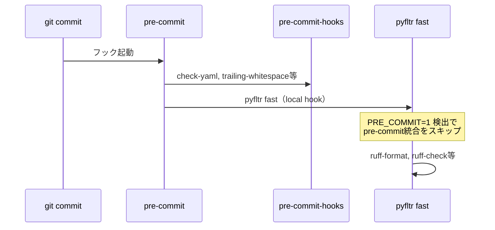

# 推奨設定例

## pyproject.toml

pyfltr本体の設定（`[tool.pyfltr]`）と、呼び出される各ツール（ruff / mypy / pytest）の設定を1つの`pyproject.toml`にまとめた例。

- `preset = "latest"`: 各時点での推奨ツール構成。詳細は[プリセット設定](configuration.md#preset)を参照。
- `python = true`: Python系ツールのゲートを開ける。推奨ツール（ruff-format / ruff-check / mypy /
  pylint / pyright / pytest / uv-sort）を一式有効化する。
  Python系ツール一式は本体依存に同梱されているため、`uvx pyfltr`単発で利用できる。
  dev依存に固定したい場合は`uv add --dev pyfltr`（pip環境では`pip install pyfltr`）を使う。
- `pylint-args`: pylintに追加で渡す引数。`--load-plugins=pylint_pydantic`と
  `--enable-error-code=unused-awaitable`（mypy）は自動オプションで既定有効のため個別指定不要。
- ruffの `per-file-ignores`: テストコード（`**_test.py`）とpackage init（`__init__.py`）のdocstring要求を除外する実用的な調整。

`uvx pyfltr`での実行では`pyproject.toml`にpyfltrを記述する必要はなく、`[tool.pyfltr]`セクションのみで完結する。
dev依存に固定する場合のみ`[dependency-groups] dev`に`"pyfltr"`を追加する（後置の併記例）。

```toml
[tool.pyfltr]
preset = "latest"
python = true
pylint-args = ["--jobs=4"]

[tool.ruff]
# https://docs.astral.sh/ruff/configuration/
line-length = 128

[tool.ruff.lint]
# https://docs.astral.sh/ruff/linter/#rule-selection
select = [
    # pydocstyle
    "D",
    # pycodestyle
    "E",
    # Pyflakes
    "F",
    # pyupgrade
    "UP",
    # flake8-bugbear
    "B",
    # flake8-simplify
    "SIM",
    # flake8-import-conventions
    "ICN",
    # isort
    "I",
]
ignore = [
    "D107", # Missing docstring in `__init__`
    "D415", # First line should end with a period
]

[tool.ruff.lint.pydocstyle]
convention = "google"

[tool.ruff.lint.per-file-ignores]
"**_test.py" = ["D"]
"**/__init__.py" = ["D104"]  # Missing docstring in public package

[tool.mypy]
# https://mypy.readthedocs.io/en/stable/config_file.html
allow_redefinition = true
check_untyped_defs = true
ignore_missing_imports = true
strict_optional = true
strict_equality = true
warn_no_return = true
warn_redundant_casts = true
warn_unused_configs = true
show_error_codes = true

[tool.pytest.ini_options]
# https://docs.pytest.org/en/latest/reference/reference.html#ini-options-ref
addopts = "--showlocals -p no:cacheprovider --maxfail=5 --durations=30 --durations-min=0.5"
log_level = "DEBUG"
xfail_strict = true
asyncio_mode = "strict"
asyncio_default_fixture_loop_scope = "session"
asyncio_default_test_loop_scope = "session"
```

### typosの許可語設定

プロジェクト固有の許可語がある場合は`pyproject.toml`の`[tool.typos]`セクションに追記する。
typos-cliは`pyproject.toml`の`[tool.typos]`を公式にサポートしているため、`_typos.toml`を別ファイルとして管理する必要はない。

```toml
[tool.typos.default.extend-words]
teh = "teh"
hte = "hte"
```

識別子（変数名・関数名）単位で許可したい場合は`[tool.typos.default.extend-identifiers]`を使う。
詳細は[typos公式ドキュメント](https://github.com/crate-ci/typos/blob/master/docs/reference.md)を参照。

### JS/TSを併用するプロジェクトでの推奨設定

JS/TSを併用するプロジェクトでは、`js-runner`をプロジェクトのパッケージマネージャーに合わせることを推奨する。
既定の`pnpx`はツールを都度取得するため、CIで毎回ダウンロードが発生する。
`pnpm`や`npm`など、プロジェクトで使用しているパッケージマネージャーを指定すれば、
`package.json`で管理済みのパッケージを再利用できる。

```toml
[tool.pyfltr]
js-runner = "pnpm"
```

`pnpm` / `npm` / `yarn` / `direct`では`textlint-packages`は無視される（`package.json`側でインストールする前提のため）。
textlintのプリセットやルールも`package.json`の`devDependencies`で管理すること。

詳細は[設定項目（ツール別）](configuration-tools.md)の「npm系ツール」を参照。

## .pre-commit-config.yaml

```yaml
  - repo: local
    hooks:
      - id: pyfltr
        name: pyfltr
        entry: uvx pyfltr fast
        types_or: [python, markdown, toml]
        require_serial: true
        language: system
```

注意: `default_language_version`にはプロジェクトが要求するPythonバージョンを指定する。
PEP 695型パラメーター構文（`def f[T](): ...`）を使用するプロジェクトではPython 3.12以上が必要。
バージョンが不一致だと`check-ast`や`debug-statements`フックがSyntaxErrorで失敗する。

ポイント:

- `uvx pyfltr fast`: 毎回最新のpyfltrを解決して実行する（uvがキャッシュするため2回目以降は実用速度）。
  dev依存に`pyfltr`を加えている場合は`entry: uv run --frozen pyfltr fast`に置き換えてもよい。
- `fast`: mypy / pylint / pytestなど重いコマンドを除外した高速サブセット。
  formatterがファイルを修正しただけではフックを失敗と判定しない。pre-commitは対話的フックのため速度を優先する。
- `types_or`: 必要な種別を列挙する。markdownはtextlint / markdownlint、TOML（pyproject.toml）でuv-sort。
- `require_serial: true`: pyfltr自身が内部で並列化するため、pre-commit側での多重起動を避ける。

速度優先のため`pyfltr fast`の使用を推奨する。
pre-commit統合の自動スキップなど双方向の挙動は[トラブルシューティング](troubleshooting.md)を参照。

## pyfltrとpre-commitの呼び出し経路

pyfltrはpre-commitを内部で呼び出し、pre-commitはpyfltrをフックとして呼び出す。
git commit経由でpre-commitが起動した場合は、pyfltrが`PRE_COMMIT=1`を検出して
内部のpre-commit統合を自動スキップし、二重実行を防ぐ。



逆に`make test`等から`pyfltr run`を呼び出した場合は、pyfltr側が`SKIP=pyfltr`付きで`pre-commit run --all-files`を起動する。
これによりpre-commit-hooks（check-yaml等）を統合実行できる。
詳細な挙動と無効化手順は[トラブルシューティング](troubleshooting.md)を参照。

## タスクランナー

pyfltrを呼び出すタスクランナーの設定例。
言語を問わず`uvx pyfltr`を使える。
pre-commitはpyfltrの依存に含まれるため、`uvx pre-commit`で利用可能になる。

### Makefile

`uvx`方式では毎回最新のpyfltrを解決して実行できる（uvがキャッシュするため2回目以降は実用速度）。

```makefile
.PHONY: format test

# フォーマット + 軽量lint（開発時の手動実行用。自動修正あり）
format:
	uvx pyfltr fast

# 全チェック実行（これを通過すればコミット可能）
test:
	uvx pyfltr run
```

dev依存に`pyfltr`を固定する運用では`UV_FROZEN`でlockfileを尊重しつつ、`uv sync`後に`uv run pyfltr ...`を呼び出す形に置き換えられる。

```makefile
export UV_FROZEN := 1

help:
	@cat Makefile

# 開発環境のセットアップ
setup:
	uv sync --all-groups --all-extras
	uvx pre-commit install

# 依存パッケージをアップグレードし全テスト実行
update:
	env --unset UV_FROZEN uv sync --upgrade --all-groups
	uvx pre-commit autoupdate
	$(MAKE) test

# フォーマット + 軽量lint（開発時の手動実行用。自動修正あり）
format:
	uv run pyfltr fast

# 全チェック実行（これを通過すればコミット可能）
test:
	uv run pyfltr run

.PHONY: help setup update format test
```

### mise.toml

言語を問わず利用可能。

```toml
[tools]
...
uv = "latest"

[tasks.setup]
description = "開発環境のセットアップ"
run = [
  "...",
  "uvx pre-commit install",
]

[tasks.format]
description = "フォーマット + 軽量lint（開発時の手動実行用。自動修正あり）"
run = [
  "uvx pyfltr fast",
]

[tasks.test]
description = "全チェック (pyfltr run がpre-commitを内部で呼び出す)"
run = [
  "uvx pyfltr run",
]

[tasks.ci]
description = "CI向け全チェック (差分検知で失敗)"
run = [
  "uvx pyfltr ci",
]
```

ポイント:

- `setup`: 開発環境のセットアップ
- `format`: `pyfltr fast`（fix段→formatter段→軽量linter段 + 内部pre-commit統合）を実行する。
  pre-commit-fastが既定でTrueのため、pre-commit-hooks（check-yaml等）もこの1コマンドで実行される
- `test`: ローカル開発用。`pyfltr run`がpre-commitを内部で呼び出すため、1コマンドで全チェックが完結する
- `ci`: CI用。`pyfltr ci`はformatter差分も含めて失敗扱いにする

## .markdownlint-cli2.yaml

markdownlint-cli2が読み込む設定ファイル。`$schema`を指定してエディタ補完を有効化する。

```yaml
$schema: https://raw.githubusercontent.com/DavidAnson/markdownlint-cli2/v0.20.0/schema/markdownlint-cli2-config-schema.json
config:
  # MD013: コードブロック内を除外し、127文字を上限とする補助的な検査として使用
  line-length:
    line_length: 127
    code_blocks: false
  # Makefileのコードブロック内でタブ文字を使うため、コードブロック内のみ許可
  no-hard-tabs:
    code_blocks: false
```

## .textlintrc.yaml

textlintで技術文書向けの複数プリセットと誤用語チェックを併用する例。
対応する`textlint-packages`の設定例は本ページ後半の「textlint-packagesのカスタマイズ」節を参照。

```yaml
rules:
  preset-ja-technical-writing:
    # ラベル型見出し（"ポイント:", "例:" など）のため、文末句点の強制を無効化する
    ja-no-mixed-period: false
    # 技術文書における自然な助詞連結（「〜かどうかを検討するか」など）が頻出するため無効化する
    no-doubled-joshi: false
    # 引用文や詳細な技術説明で100文字超過が避けられないため緩和する
    sentence-length:
      max: 120
    # ドキュメントを常体（である調）で統一する方針のため
    no-mix-dearu-desumasu:
      preferInHeader: ""
      preferInBody: "である"
      preferInList: "である"
      strict: false
  preset-jtf-style:
    "1.1.3.箇条書き":
      shouldUsePoint: false # 箇条書きは「。」をつけない
    # コロン終端のラベル記法を多用するため無効化する
    "4.2.7.コロン(：)": false
  ja-no-abusage: true
```

## textlint-packagesのカスタマイズ

追加のtextlintプリセットを使う場合は`textlint-packages`にパッケージ名を列挙する
（pnpx / npx起動時に`--package` / `-p`として展開される）。

```toml
[tool.pyfltr]
textlint-packages = [
    "textlint-rule-preset-ja-technical-writing",
    "textlint-rule-preset-jtf-style",
    "textlint-rule-ja-no-abusage",
]
```

共通のコマンドライン引数を追加したい場合は `textlint-args` を使う。
lint専用のオプション（`--format compact` など）は `textlint-lint-args` に分離する。

```toml
[tool.pyfltr]
textlint-args = []
textlint-lint-args = ["--format", "compact"]
```

旧版の`textlint-args = ["--format", "compact", ...]`をそのまま引き継いでもクラッシュしない。
pyfltrはfix段の起動コマンドから`--format`ペアを自動除去するため。
ただし新規設定では`textlint-lint-args`に書くことを推奨する。

## 呼び出し方の使い分け

状況に応じて`pyfltr`の呼び出し方を以下のいずれかから選ぶ。

| 状況 | 呼び出し方 | 補足 |
| --- | --- | --- |
| 公式Dockerイメージ内（CI推奨構成） | `pyfltr ...` | イメージ同梱の本体を直接呼ぶ。uvキャッシュ経由の解決を挟まない |
| コンテナ外・dev依存に固定しない | `uvx pyfltr ...` | uvが毎回最新を解決する。ローカル開発・軽量CIで使用 |
| コンテナ外・dev依存に固定する | `uv run pyfltr ...` | `uv add --dev pyfltr`済みのプロジェクトで使う。`UV_FROZEN`との併用を推奨 |

## CI

GitHub Actionsでpyfltrを実行する構成の例。
リリース時に発行する公式Dockerイメージ`ghcr.io/ak110/pyfltr`を`container:`として利用する形を推奨する。
`uv` / `pnpm` / `mise` / `hadolint` / `pinact` / `shellcheck`等が同梱され、
セットアップステップを毎回流す手間が省ける。
キャッシュディレクトリは`/cache`配下にまとめて配置済み（`uv`は`/cache/uv`、`pnpm`は`/cache/pnpm`、`mise`は`/cache/mise`）。

Dockerイメージにpyfltr本体を同梱しているため、CI内では`pyfltr`を直接呼び出す。
`uvx pyfltr`を使うとコンテナ起動ごとにuvキャッシュ経由のツール解決が走り、コンテナ同梱版を使う利点が薄れるため。

```yaml
jobs:
  test:
    runs-on: ubuntu-latest
    strategy:
      matrix:
        python-version: ["3.11", "3.12", "3.13"]
    container:
      image: ghcr.io/ak110/pyfltr:latest
    defaults:
      run:
        shell: bash
    env:
      UV_PYTHON: ${{ matrix.python-version }}
    steps:
      - uses: actions/checkout@v6

      - name: Cache /cache
        uses: actions/cache@v5
        with:
          path: /cache
          key: pyfltr-cache-${{ runner.os }}-py${{ matrix.python-version }}

      - name: Run pyfltr
        run: pyfltr ci --output-format=github-annotations
```

ポイント。

- `image: ghcr.io/ak110/pyfltr:latest`: `vX.Y.Z`タグも併発行されるため、再現性を重視する場合は固定タグを指定する。
  イメージには`UV_FROZEN=1`と`pnpm config set minimum-release-age 1440`が事前設定されているため、
  CIワークフロー側で同じ環境変数や設定を再指定する必要はない。
- `defaults.run.shell: bash`: GitHub Actionsの`container:`既定シェルは`sh`であり、
  既存ワークフローで多用される`set -euo pipefail`等のbash前提の記述を通すために指定する。
- `UV_PYTHON`: `uv run`が必要なCPythonをロックファイルとmatrix値に従って自動取得する。`actions/setup-python`は不要。
  単一バージョンで十分な場合は`strategy.matrix`と`UV_PYTHON`を省ける。
- `actions/cache`: `/cache`配下を一括キャッシュする。
  uv / pnpm / miseのキャッシュは内容アドレス指定のため、ロックファイル変更時も追加分がそのまま積み重なる。
  キーはOSのみで足り、ロックファイルhashなどの細かい無効化は不要。
- `pyfltr ci`: イメージ同梱のpyfltrをそのまま使う。
  uvキャッシュを介した解決を毎回挟まず、コンテナビルド時に確定したバージョンで実行できる。
  特定バージョンに固定したい場合は`image:`のタグ（`vX.Y.Z`）で揃える。
- `--output-format=github-annotations`: `::error file=...` / `::warning file=...`形式の行を標準出力へ書き出す。
  プル要求の該当ファイル行にコメントとして表示される。

### Dockerイメージを使わない場合（setup-uv方式）

自前runner制約等でDockerイメージを使えない場合は、`astral-sh/setup-uv`でuvを導入し、Node.js / pnpmを別途セットアップする。
`UV_FROZEN`・`PYTHONDEVMODE`等の環境変数や`pnpm config set minimum-release-age 1440`は
ワークフロー側で個別指定する必要がある（Dockerイメージでは事前設定済み）。

```yaml
env:
  PYTHONDEVMODE: "1"
  UV_FROZEN: "1"

jobs:
  test:
    runs-on: ubuntu-latest
    strategy:
      matrix:
        python-version: ["3.11", "3.12", "3.13", "3.14"]
    steps:
      - uses: actions/checkout@v6
      - uses: astral-sh/setup-uv@v8
        with:
          python-version: ${{ matrix.python-version }}
          enable-cache: true
      - uses: actions/setup-node@v6
        with:
          node-version: "lts/*"
      - uses: pnpm/action-setup@v6
        with:
          version: latest
      - run: pnpm config set minimum-release-age 1440 --global
      - run: uvx pyfltr ci --output-format=github-annotations
      - run: uv cache prune --ci
```

### PRの差分ファイルのみを対象にする

PR（プルリクエスト）で変更したファイルだけを対象に実行したい場合は`--changed-since`を使う。
ベースブランチとの差分ファイルのみにチェックを絞ることで、大規模リポジトリでの実行時間を短縮できる。

```yaml
      - name: Test with pyfltr (changed files only)
        run: uvx pyfltr ci --changed-since=origin/main --output-format=github-annotations
```

`--changed-since=origin/main`は`origin/main`からの差分ファイルに絞り込んで実行する。
対象は`git diff --name-only`が返すコミット差分・trackedファイルの作業ツリー差分・staged差分の和集合となり、
untrackedの新規ファイルは対象外。
gitが不在またはrefが解決できない場合は警告を出して全体実行へフォールバックする。

### GitLab CIでMerge Requestへ表示する

GitLab CIでは`--output-format=code-quality`でCode Climate JSON issue形式のサブセットを出力する。
これを`artifacts:reports:codequality`としてアップロードするとMerge Request画面のCode Quality widgetに反映される。
MR diffインライン表示はUltimate tier限定。

```yaml
stages:
  - lint

pyfltr:
  stage: lint
  image: ghcr.io/astral-sh/uv:python3.13-bookworm
  variables:
    PYTHONDEVMODE: "1"
    UV_FROZEN: "1"
  script:
    - uvx pyfltr ci --output-format=code-quality --output-file=code-quality-report.json
  artifacts:
    when: always
    reports:
      codequality: code-quality-report.json
```

ポイント。

- `--output-format=code-quality`: Code Climate JSON issue形式の配列を出力する。
  `--output-file`を指定するとstdoutには従来の`text`整形出力が並行して出るため、ジョブログで進捗を確認できる。
- `artifacts:reports:codequality`: 生成したJSONファイルをGitLabに取り込む。
  Merge Request画面のCode Quality widget（全tier）とMR diffインライン表示（Ultimate tier）に反映される。
- `when: always`: ジョブが失敗してもアーティファクトを残す指定。lintエラーで`exit 1`したときもレポートを取り込めるようにする。

---

Python以外のプロジェクトでの推奨設定例については[推奨設定例（非Pythonプロジェクト）](recommended-nonpython.md)を参照。
