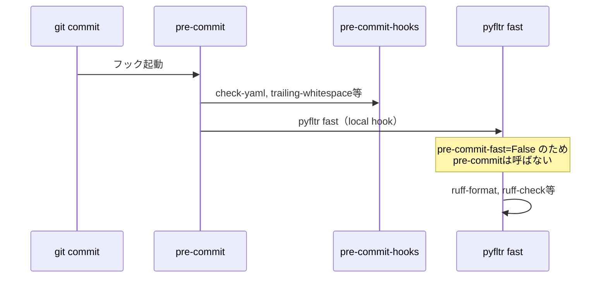
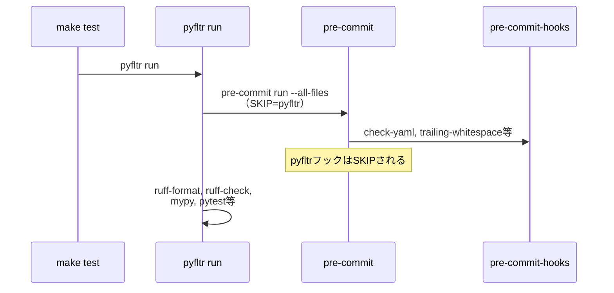
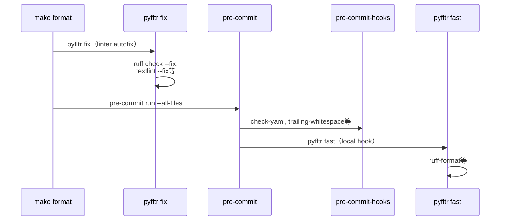

# 推奨設定例

## pyproject.toml

pyfltr本体の設定（`[tool.pyfltr]`）と、呼び出される各ツール（ruff / mypy / pytest）の設定を1つの`pyproject.toml`にまとめた例。

- `preset = "latest"`: 主要ツールを有効化するプリセット（現在は`20260413`相当）。ruff-format / ruff-check / pyright / pre-commit等が有効化される。詳細は[docs/configuration.md](configuration.md)の「プリセット設定」を参照。
- `pylint-args`: pylintに追加で渡す引数。`--load-plugins=pylint_pydantic`と`--enable-error-code=unused-awaitable`（mypy）は自動オプションで既定有効のため個別指定不要。
- ruffの `per-file-ignores`: テストコード（`**_test.py`）とpackage init（`__init__.py`）のdocstring要求を除外する実用的な調整。

```toml
[dependency-groups]
dev = [
    ...
    "pyfltr",
]

...

[tool.pyfltr]
preset = "latest"
pylint-args = ["--jobs=4"]

[tool.ruff]
# https://docs.astral.sh/ruff/configuration/
line-length = 128

[tool.ruff.lint]
# https://docs.astral.sh/ruff/linter/#rule-selection
select = [
    # pydocstyle
    "D",
    # pycodestyle
    "E",
    # Pyflakes
    "F",
    # pyupgrade
    "UP",
    # flake8-bugbear
    "B",
    # flake8-simplify
    "SIM",
    # flake8-import-conventions
    "ICN",
    # isort
    "I",
]
ignore = [
    "D107", # Missing docstring in `__init__`
    "D415", # First line should end with a period
]

[tool.ruff.lint.pydocstyle]
convention = "google"

[tool.ruff.lint.per-file-ignores]
"**_test.py" = ["D"]
"**/__init__.py" = ["D104"]  # Missing docstring in public package

[tool.mypy]
# https://mypy.readthedocs.io/en/stable/config_file.html
allow_redefinition = true
check_untyped_defs = true
ignore_missing_imports = true
strict_optional = true
strict_equality = true
warn_no_return = true
warn_redundant_casts = true
warn_unused_configs = true
show_error_codes = true

[tool.pytest.ini_options]
# https://docs.pytest.org/en/latest/reference/reference.html#ini-options-ref
addopts = "--showlocals -p no:cacheprovider --maxfail=5 --durations=30 --durations-min=0.5"
log_level = "DEBUG"
xfail_strict = true
asyncio_mode = "strict"
asyncio_default_fixture_loop_scope = "session"
asyncio_default_test_loop_scope = "session"
```

### JS/TSを併用するプロジェクトでの推奨設定

JS/TSを併用するプロジェクトでは、`js-runner`をプロジェクトのパッケージマネージャーに合わせることを推奨する。
既定の`pnpx`はツールを都度取得するため、CIで毎回ダウンロードが発生する。
`pnpm`や`npm`など、プロジェクトで使用しているパッケージマネージャーを指定すれば、`package.json`で管理済みのパッケージを再利用できる。

```toml
[tool.pyfltr]
js-runner = "pnpm"
```

`pnpm` / `npm` / `yarn` / `direct`では`textlint-packages`は無視される（`package.json`側でインストールする前提のため）。
textlintのプリセットやルールも`package.json`の`devDependencies`で管理すること。

詳細は[docs/guide/configuration-tools.md](configuration-tools.md)の「npm系ツール」を参照。

## .pre-commit-config.yaml

```yaml
  - repo: local
    hooks:
      - id: pyfltr
        name: pyfltr
        entry: uv run --frozen pyfltr fast
        types_or: [python, markdown, toml]
        require_serial: true
        language: system
```

ポイント:

- `--frozen`: `uv run`が依存解決を再実行せず`uv.lock`をそのまま使うようにする（サプライチェーン攻撃対策）。
- `fast`: mypy / pylint / pytestなど重いコマンドを除外した高速サブセット。formatterがファイルを修正しただけではフックを失敗と判定しない。pre-commitは対話的フックのため速度を優先する。
- `types_or`: 必要な種別を列挙する。markdownはmarkdownlint / textlint、TOML（pyproject.toml）でuv-sort。
- `require_serial: true`: pyfltr自身が内部で並列化するため、pre-commit側での多重起動を避ける。

注意: pre-commitのlocal hookから`pyfltr run`や`pyfltr ci`を呼び出すと、pyfltrが内部で`pre-commit run --all-files`を再帰呼び出しする。`pre-commit-fast = False`（既定）により`pyfltr fast`にはpre-commit統合が含まれないため、この問題は発生しない。pre-commitフックからは必ず`pyfltr fast`を使用すること。

## pyfltrとpre-commitの呼び出し経路

pyfltrはpre-commitを内部で呼び出し、pre-commitはpyfltrをフックとして呼び出す。この双方向の関係を以下に図示する。

### git commit時



### make test時



### make format時



## タスクランナー

pyfltrを呼び出すタスクランナーの設定例。pyfltrをdev依存に含むPythonプロジェクトでは`uv run pyfltr`、含まないプロジェクトでは`uvx pyfltr`を使う。pre-commitはpyfltrの依存に含まれるため、`uv run pre-commit`や`uvx pre-commit`で利用可能になる。

### Makefile

Pythonプロジェクト向けの例。`UV_FROZEN`でlockfileを尊重する。

```makefile
export UV_FROZEN := 1

help:
	@cat Makefile

# 開発環境のセットアップ
setup:
	uv sync --all-groups --all-extras
	uv run pre-commit install

# 依存パッケージをアップグレードし全テスト実行
update:
	env --unset UV_FROZEN uv sync --upgrade --all-groups --all-extras
	uv run pre-commit autoupdate
	$(MAKE) test

# フォーマット + 軽量lint（開発時の手動実行用。自動修正あり）
format:
	-uv run pyfltr fix
	uv run pre-commit run --all-files

# 全チェック実行（これを通過すればコミット可能）
test:
	uv run pyfltr run

.PHONY: help setup update format test
```

非Pythonプロジェクト向けの例。`uvx`で都度取得する。

```makefile
.PHONY: format test

# フォーマット + 軽量lint（開発時の手動実行用。自動修正あり）
format:
	-uvx pyfltr fix
	uvx pre-commit run --all-files

# 全チェック実行（これを通過すればコミット可能）
test:
	uvx pyfltr run
```

### mise.toml

言語を問わず利用可能。Pythonプロジェクトでmiseを使う場合は`uvx pyfltr`を`uv run pyfltr`に読み替える。

```toml
[tools]
...
uv = "latest"

[tasks.setup]
description = "開発環境のセットアップ"
run = [
  "...",
  "uvx pre-commit install",
]

[tasks.format]
description = "フォーマット + 軽量lint（開発時の手動実行用。自動修正あり）"
run = [
  "uvx pyfltr fix || true",
  "uvx pre-commit run --all-files",
]

[tasks.test]
description = "全チェック (pyfltr run がpre-commitを内部で呼び出す)"
run = [
  "uvx pyfltr run",
]

[tasks.ci]
description = "CI向け全チェック (差分検知で失敗)"
run = [
  "uvx pyfltr ci",
]
```

ポイント:

- `setup`: 開発環境のセットアップ
- `format`: `pyfltr fix`でlinterのautofixを実行した後、`pre-commit run --all-files`でformatterとpre-commit-hooksを実行する
- `test`: ローカル開発用。`pyfltr run`がpre-commitを内部で呼び出すため、1コマンドで全チェックが完結する
- `ci`: CI用。`pyfltr ci`はformatter差分も含めて失敗扱いにする

## .markdownlint-cli2.yaml

markdownlint-cli2が読み込む設定ファイル。`$schema`を指定してエディタ補完を有効化する。

```yaml
$schema: https://raw.githubusercontent.com/DavidAnson/markdownlint-cli2/v0.20.0/schema/markdownlint-cli2-config-schema.json
config:
  # 日本語ドキュメントでは行長制限が実用的でないため無効化
  line-length: false
  # Makefileのコードブロック内でタブ文字を使うため、コードブロック内のみ許可
  no-hard-tabs:
    code_blocks: false
```

## .textlintrc.yaml

textlintで技術文書向けの複数プリセットと誤用語チェックを併用する例。
対応する`textlint-packages`の設定例は[textlint-packagesのカスタマイズ](#textlint-packagesのカスタマイズ)を参照。

```yaml
rules:
  preset-ja-technical-writing:
    # ラベル型見出し ("ポイント:", "例:" など) が多用されるため、文末句点の強制を無効化する
    ja-no-mixed-period: false
    # 技術文書における自然な助詞連結 (「〜かどうかを検討するか」など) が頻出するため無効化する
    no-doubled-joshi: false
    # 引用文や詳細な技術説明で100文字超過が避けられないため緩和する
    sentence-length:
      max: 120
    # ドキュメントを常体（である調）で統一する方針のため
    no-mix-dearu-desumasu:
      preferInHeader: ""
      preferInBody: "である"
      preferInList: "である"
      strict: false
  preset-jtf-style:
    "1.1.3.箇条書き":
      shouldUsePoint: false # 箇条書きは「。」をつけない
    # コロン終端のラベル記法を多用するため無効化する
    "4.2.7.コロン(：)": false
  ja-no-abusage: true
```

## textlint-packagesのカスタマイズ

追加のtextlintプリセットを使う場合は `textlint-packages` にパッケージ名を列挙する（pnpx / npx起動時に `--package` / `-p` として展開される）。

```toml
[tool.pyfltr]
textlint-packages = [
    "textlint-rule-preset-ja-technical-writing",
    "textlint-rule-preset-jtf-style",
    "textlint-rule-ja-no-abusage",
]
```

共通のコマンドライン引数を追加したい場合は `textlint-args` を使う。
lint専用のオプション（`--format compact` など）は `textlint-lint-args` に分離する。

```toml
[tool.pyfltr]
textlint-args = []
textlint-lint-args = ["--format", "compact"]
```

旧版の`textlint-args = ["--format", "compact", ...]`をそのまま引き継いでもクラッシュしない。
pyfltrは`pyfltr fix`実行時にfix段階の起動コマンドから`--format`ペアを自動除去するため。
ただし新規設定では`textlint-lint-args`に書くことを推奨する。

## CI

GitHub Actionsでpyfltrを実行する構成の例。

```yaml
env:
  # 開発モード: DeprecationWarningなどの隠れた問題を早期検出する
  PYTHONDEVMODE: "1"
  # サプライチェーン攻撃対策: uvがlockfileを常に尊重する
  UV_FROZEN: "1"

jobs:
  test:
    runs-on: ubuntu-latest
    strategy:
      matrix:
        python-version: ["3.11", "3.12", "3.13", "3.14"]
    steps:
      - uses: actions/checkout@v6

      - name: Install uv
        uses: astral-sh/setup-uv@v8
        with:
          python-version: ${{ matrix.python-version }}
          enable-cache: true

      - name: Setup Node.js
        uses: actions/setup-node@v6
        with:
          node-version: "lts/*"

      - name: Setup pnpm
        uses: pnpm/action-setup@v6
        with:
          version: latest

      - name: Configure pnpm security
        run: pnpm config set minimum-release-age 1440 --global

      - name: Install dependencies
        run: uv sync --all-extras --all-groups

      - name: Test with pyfltr
        run: uv run pyfltr ci

      - name: Prune uv cache for CI
        run: uv cache prune --ci
```

ポイント:

- `env.PYTHONDEVMODE: "1"`: Pythonの開発モードを有効化する。`DeprecationWarning`の表示や各種デバッグチェックが有効になり、隠れた問題を早期に検出できる。
- `env.UV_FROZEN: "1"`: サプライチェーン攻撃対策として、ワークフロー全体で`uv sync`/`uv run`が`uv.lock`を尊重するよう強制する。意図しない再resolveでロックファイルが書き換わるリスクを抑える。
- `actions/setup-node` + `pnpm/action-setup`: `markdownlint-cli2`と`textlint`をpnpx経由で呼び出すため、PythonだけでなくNode.js環境も必要になる。
- `pnpm config set minimum-release-age 1440`: サプライチェーン攻撃対策として、公開から24時間（1440分）未満のパッケージのインストールを拒否する。
- `uv sync --all-extras --all-groups`: pyfltrを含むdev依存をすべて同期し、`uv run pyfltr`から対応ツール群を解決できるようにする。`UV_FROZEN=1`下でも`uv.lock`をそのまま使うため問題なく動作する。
- `uv cache prune --ci`: CIキャッシュを軽量化するための後処理。

## Claude Codeプラグイン

`.claude/settings.json`に以下の内容を記述することで、いくつかのHook/Skillを有効化できる。

詳細は<https://github.com/ak110/dotfiles/blob/master/docs/guide/claude-code-guide.md>を参照。

```json
{
  "extraKnownMarketplaces": {
    "ak110-dotfiles": {
      "source": {
        "source": "github",
        "repo": "ak110/dotfiles"
      }
    }
  },
  "enabledPlugins": {
    "agent-toolkit@ak110-dotfiles": true
  }
}
```

---

Python以外のプロジェクトでの推奨設定例については[非Pythonプロジェクト推奨設定例](recommended-nonpython.md)を参照。
