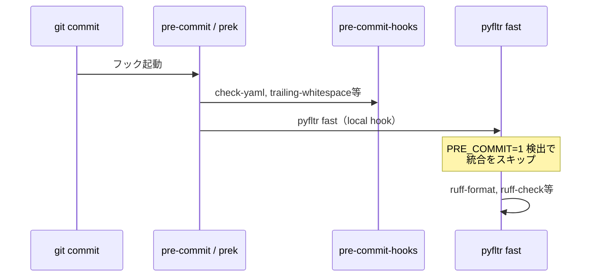

# 推奨設定例

Pythonプロジェクト向けの推奨構成例（pyproject.toml・prek・タスクランナー・CI設定）。
設定して実行するところから始める場合は[はじめに](getting-started.md)を参照。

## pyproject.toml

pyfltr本体の設定（`[tool.pyfltr]`）と、呼び出される各ツール（ruff / mypy / pytest）の設定を1つの`pyproject.toml`にまとめた例。

- `preset = "latest"`: 各時点での推奨ツール構成。詳細は[プリセット設定](configuration.md#preset)を参照
- `python = true`: Python系ツールのゲートを開ける。推奨ツール（ruff-format / ruff-check / mypy /
  pylint / pyright / pytest / uv-sort）を一式有効化する
    - Python系ツール一式は本体依存に同梱されているため、`uvx pyfltr`単発で利用できる
    - dev依存に固定する場合は`uv add --dev "pyfltr[python]"`（pip環境では`pip install pyfltr`）を使う
- `pylint-args`: pylintに追加で渡す引数。`--load-plugins=pylint_pydantic`と
  `--enable-error-code=unused-awaitable`（mypy）は自動オプションで既定有効のため個別指定不要
- `[tool.pylint."messages control"]`: pylintのdisableリストを`pyproject.toml`に集約することで、
  `.pylintrc`を別途配置する必要がなくなり設定の所在が`pyproject.toml`1ファイルにまとまる
    - ruffの`D`カテゴリが`missing-*-docstring`相当を検出するため、
    pylint側の同系ルールは無効化しても品質低下は招かない
    - `missing-class-docstring`はテストクラスに対する儀礼的docstring付与を無効化する
    - `missing-module-docstring`は`__init__.py`等でモジュールdocstring要求を緩和する目的で無効化する
- `[tool.pylint."messages control"]`のdisableリストから`"duplicate-code"`（R0801）を除去し重複検出を有効化する。
  `[tool.pylint.similarities]`は有効化済みの検査に対し`min-similarity-lines = 10`で閾値を設定する
    - 閾値10は4プロジェクトの既存コード計測に基づき、ノイズ抑制と実重複の捕捉を両立する規模として選定した
    - 閾値4の検出件数はdotfiles 225件 / pyfltr 109件 / pytilpack 41件 / smpr 0件である
    - 閾値10の検出件数はdotfiles 31件 / pyfltr 9件 / pytilpack 12件 / smpr 0件である
    - 検出時は実重複か否かを判別する。実重複であれば共通化のリファクタリングを第一候補とし、
      意図的な並行実装や共通化すべきでない類似は理由コメント付き`# pylint: disable=duplicate-code`で個別抑制する。
      disableリストへの再追加や根拠を示さない閾値変更はしない
- ruffの `per-file-ignores`: テストコード（`**_test.py`）とpackage init（`__init__.py`）のdocstring要求を除外する実用的な調整

`uvx pyfltr`での実行では`pyproject.toml`にpyfltrを記述する必要はなく、`[tool.pyfltr]`セクションのみで完結する。
dev依存に固定する場合のみ`[dependency-groups] dev`に`"pyfltr[python]"`を追加する（後置の併記例）。

```toml
[tool.pyfltr]
preset = "latest"
python = true
pylint-args = ["--jobs=4"]

[tool.pylint."messages control"]
disable = [
    "broad-exception-caught",
    "fixme",
    "invalid-name",
    "line-too-long",
    "logging-fstring-interpolation",
    "logging-not-lazy",
    "missing-class-docstring",
    "missing-function-docstring",
    "missing-module-docstring",
    "no-else-return",
    "too-few-public-methods",
    "too-many-arguments",
    "too-many-boolean-expressions",
    "too-many-branches",
    "too-many-instance-attributes",
    "too-many-lines",
    "too-many-locals",
    "too-many-nested-blocks",
    "too-many-positional-arguments",
    "too-many-public-methods",
    "too-many-return-statements",
    "too-many-statements",
]

[tool.pylint.similarities]
min-similarity-lines = 10

[tool.ruff]
# https://docs.astral.sh/ruff/configuration/
line-length = 128

[tool.ruff.lint]
# https://docs.astral.sh/ruff/linter/#rule-selection
select = [
    # pydocstyle
    "D",
    # pycodestyle
    "E",
    # Pyflakes
    "F",
    # pyupgrade
    "UP",
    # flake8-bugbear
    "B",
    # flake8-simplify
    "SIM",
    # flake8-import-conventions
    "ICN",
    # isort
    "I",
]
ignore = [
    "D107", # Missing docstring in `__init__`
    "D415", # First line should end with a period
    "D403", # First word of the first line should be properly capitalized（日本語docstringにそぐわないため）
]

[tool.ruff.lint.pydocstyle]
convention = "google"

[tool.ruff.lint.per-file-ignores]
"**_test.py" = ["D"]
"**/__init__.py" = ["D104"]  # Missing docstring in public package

[tool.mypy]
# https://mypy.readthedocs.io/en/stable/config_file.html
allow_redefinition = true
check_untyped_defs = true
ignore_missing_imports = true
strict_optional = true
strict_equality = true
warn_no_return = true
warn_redundant_casts = true
warn_unused_configs = true
show_error_codes = true

[tool.pytest.ini_options]
# https://docs.pytest.org/en/latest/reference/reference.html#ini-options-ref
addopts = [
    "--showlocals",
    "-p", "no:cacheprovider",
    "--maxfail=5",
    "--durations=30",
    "--durations-min=0.5",
    "--timeout=60",
    # コア数追従（-n auto 等）を採用せず固定値とする（CI環境での逆効果とメモリ消費増を避けるため）
    "-n", "4",
    # 未実行テストを動的分配し、特定ファイルへの偏りによる律速を回避する
    "--dist=worksteal",
]
log_level = "DEBUG"
xfail_strict = true
asyncio_mode = "strict"
asyncio_default_fixture_loop_scope = "session"
asyncio_default_test_loop_scope = "session"
```

`--timeout=60`は`pytest-timeout`プラグインが必要。
`-n 4`は`pytest-xdist`プラグインが必要で、4プロセス並列でテストを実行する。
コア数追従（`-n auto`等）は採用せず固定値とする（CI環境で逆効果になり得ることと、メモリ消費の増大を避けるため）。
`--dist=worksteal`は`pytest-xdist`のwork-stealingスケジューラを有効化し、
テストファイル間の実行時間差が大きい場合でも特定workerへ偏らせない。
ランナー別の有効条件は次の通り。

- `python-runner = "direct"`経路では、pyfltrのvenv配下のpytestを直接起動するため
  本体依存の`pytest-timeout`・`pytest-xdist`がそのまま利用できる
- `uvx pyfltr`を`uv.lock`不在のディレクトリで実行する標準シナリオでは、`uv`経路の前提が満たされず
  `shutil.which`によるdirectフォールバックが発生する
    - この場合もpyfltrの本体venv同梱のpytestが採用されるため本体依存のプラグインが有効
- `uv`経路（既定）でcwdの`uv.lock`にpytestが登録されている場合は、
  利用者プロジェクトのvenvでpytestが解決される
    - プロジェクト側に`pytest-timeout`・`pytest-xdist`を導入する
    （`uv add --dev pytest-timeout pytest-xdist`等）
- `uvx`経路（per-tool直接指定でpytest用の独立環境が生成される場合）は、
  当該環境側への`pytest-timeout`・`pytest-xdist`の導入が別途必要
- pytest-xdistの並列実行下では、ポート番号・一時ファイル名・グローバル状態の競合に注意する
    - 間欠失敗するテストは並列前提に修正するか`-p no:xdist`等でxdist対象外へ退避させる
    - 各workerは自身へ割り当たったテストだけを実行するため、
    1つのモジュールが複数workerへまたがるとworkerごとにモジュールスコープのfixtureが実行される
    - 初期化を1回しか許さないプロセス内のグローバル状態は、
    モジュールスコープのfixtureで初期化せずsessionスコープへ移す
    - sessionスコープのfixtureもworkerごとに1回実行されるため、
    プロセス外の共有資源をworker間で1回だけ初期化する用途には別途排他が必要となる
    - モジュール単位で同一workerへ割り当てたい場合は`--dist=loadfile`・`--dist=loadscope`を選ぶ

### typosの許可語設定

プロジェクト固有の許可語がある場合は`pyproject.toml`の`[tool.typos]`セクションに追記する。
typos-cliは`pyproject.toml`の`[tool.typos]`を公式にサポートしているため、`_typos.toml`を別ファイルとして管理する必要はない。

```toml
[tool.typos.default.extend-words]
teh = "teh"
hte = "hte"
```

識別子（変数名・関数名）単位で許可したい場合は`[tool.typos.default.extend-identifiers]`を使う。
詳細は[typos公式ドキュメント](https://github.com/crate-ci/typos/blob/master/docs/reference.md)を参照。

### 依存の脆弱性監査の有効化（任意）

依存パッケージの脆弱性を`pyfltr`の枠組みでまとめて監査したい場合は`uv-audit`を有効化する。
`uv audit`（uv 0.10.10以降）が`pyproject.toml`を対象にPython依存の既知脆弱性を検査する。
0.10.8・0.10.9は監査対象の件数を報告するのみで脆弱性を検出しない。
外部脆弱性データベースへ問い合わせるためネットワーク接続が必須で結果が変動する。
ネットワークが不安定なCIで失敗扱いを避けたい場合は`uv-audit-severity = "warning"`で警告扱いに切り替える。

```toml
[tool.pyfltr]
uv-audit = true
# ネットワーク不調時に失敗ではなく警告として扱う場合
# uv-audit-severity = "warning"
```

既定引数`uv-audit-args = ["audit", "--preview-features", "audit", "--frozen", "--no-progress"]`は
`--frozen`を含み、監査時に`uv.lock`を書き換えない。
`--preview-features audit`は`uv audit`が実験的機能である旨の警告を抑止する。

脆弱性監査の結果はコード変更と無関係に外部データベースの更新で変動する。
このためコミット毎やpre-commitではなく、日次・週次の定期実行に向く。
監査ツールのみをまとめて実行する場合は`--commands=audit`を指定する。
GitHub Actionsでは`schedule`トリガーの専用ワークフローへ切り出し、
通常のpush/PR用CIへ混在させない構成を推奨する。
SARIF出力（`--output-format=sarif`）と`github/codeql-action/upload-sarif`を
組み合わせると、GitHub Code Scanningにアラート管理を委ねられる。
同一の脆弱性は1件のアラートに集約され、解消後の定期実行で自動クローズされる。

この構成は公開リポジトリで利用できる。
非公開リポジトリでCode Scanningを使うにはGitHub Code Securityライセンスを要する
（[公式ドキュメント](https://docs.github.com/en/code-security/code-scanning/introduction-to-code-scanning/about-code-scanning)）。
非公開リポジトリでは、追加費用なく有効化できるDependabot alertsを脆弱性通知の主経路とする。
そのうえでSARIFはファイルへ出力し、監査ツールの実行有無と検出結果の判別に用いる。
`pyfltr`はツール実行の失敗をすべて終了コード1へ正規化するため、終了コードだけでは脆弱性の検出とツールの異常を区別できない。
SARIF内に当該ツールの`runs`要素が存在するかで無言スキップを検出する。
終了コードが非0の場合に限り、`results`が空かどうかで脆弱性の検出とツールの異常を区別する。
脆弱性を検出した場合はワークフローを失敗させて通知する。

### JS/TSを併用するプロジェクトでの推奨設定

JS/TSを併用するプロジェクトでは、`js-runner`をプロジェクトのパッケージマネージャーに合わせる。
既定の`pnpx`はツールを都度取得するため、CIで毎回ダウンロードが発生する。
`pnpm`や`npm`など、プロジェクトで使用しているパッケージマネージャーを指定すると、
`package.json`で管理済みのパッケージを再利用できる。

```toml
[tool.pyfltr]
js-runner = "pnpm"
```

`pnpm` / `npm` / `yarn` / `direct`では`textlint-packages`は無視される（`package.json`側でインストールする前提のため）。
textlintのプリセットやルールも`package.json`の`devDependencies`で管理する。

詳細は[設定項目（ツール別）](configuration-tools.md)の「js-runner経由で実行するツール」を参照。

### 日本語Markdownを含むプロジェクトでの推奨設定

日本語のMarkdownを含むプロジェクトでは`colloquial-check`を有効化する。
LLMが頻繁に出力する口語的な日本語表現を検出する内蔵linterで、既定では無効（opt-in）。

```toml
[tool.pyfltr]
colloquial-check = true
```

`colloquial-check-severity`の既定は`warning`のため、有効化してもCI・pre-commitは失敗しない。
既存の文書に口語表現が残っている場合は有効化した時点から警告が出るため、一度まとめて是正する。
検査対象の既定は全ファイル（`*`）であり、日本語Markdownだけでなくソースコードや設定ファイルに含まれる日本語も検査する。
辞書に一致する正当な用法を含むファイルは`colloquial-check-exclude`で除外し、
対象を特定の拡張子へ限定する場合は`colloquial-check-targets`を指定する。

詳細は[設定項目（ツール別）](configuration-tools.md)の「colloquial-check」を参照。

## .pre-commit-config.yaml

```yaml
  - repo: local
    hooks:
      - id: pyfltr
        name: pyfltr
        entry: uvx pyfltr fast
        types_or: [python, markdown, toml]
        require_serial: true
        language: system
```

注意: `default_language_version`にはプロジェクトが要求するPythonバージョンを指定する。
PEP 695型パラメーター構文（`def f[T](): ...`）を使用するプロジェクトではPython 3.12以上が必要。
バージョンが不一致だと`check-ast`や`debug-statements`フックがSyntaxErrorで失敗する。

ポイント。

- `uvx pyfltr fast`: uvがキャッシュするため2回目以降は実用速度で動作し、毎回最新版を取得して実行する
    - dev依存にpyfltrを加えている場合は`entry: uv run --frozen pyfltr fast`に置き換えてもよい
- `fast`: mypy / pylint / pytestなど重いコマンドを除外した高速サブセット
    - formatterがファイルを修正しただけではフックを失敗と判定しない
- `types_or`: 必要な種別を列挙する
    - markdownはtextlint / markdownlint、TOML（pyproject.toml）でuv-sort
- `require_serial: true`: pyfltr自身が内部で並列化するため、pre-commit側での多重起動を抑止する

pre-commit・prek統合の自動スキップなど双方向の挙動は[トラブルシューティング](troubleshooting.md)を参照。

## pyfltrとpre-commit・prekの呼び出し経路

pyfltrはpre-commit・prekのうち有効な方を内部で呼び出し、pre-commit・prekはpyfltrをフックとして呼び出す。
git commit経由でpre-commit・prekのいずれかが起動した場合、pyfltrは`PRE_COMMIT=1`を検出する。
pyfltrは内部の統合を自動スキップし、二重実行を防ぐ。


```mermaid
sequenceDiagram
    participant U as git commit
    participant PC as pre-commit / prek
    participant PH as pre-commit-hooks
    participant PF as pyfltr fast

    U->>PC: フック起動
    PC->>PH: check-yaml, trailing-whitespace等
    PC->>PF: pyfltr fast（local hook）
    Note over PF: PRE_COMMIT=1 検出で<br/>統合をスキップ
    PF->>PF: ruff-format, ruff-check等
```

逆に`make test`等から`pyfltr run`を呼び出した場合、pyfltr側が`SKIP=pyfltr`付きで有効なpre-commitまたはprekを起動する。
pre-commitとprekは、いずれも変更ファイル指定（`--files <対象>`）で起動する。
各hook内部の`types`・`types_or`・`files`・`exclude`フィルタはファイル指定起動でも適用されるため、関係するhookのみ動作する。
これによりpre-commit-hooks（check-yaml等）を統合実行できる。
詳細な挙動と無効化手順は[トラブルシューティング](troubleshooting.md)を参照。

## タスクランナー

pyfltrを呼び出すタスクランナーの設定例。
言語を問わず`uvx pyfltr`を利用できる。
pre-commit・prekはいずれもpyfltrの依存に含まれる。
`uvx pre-commit`・`uvx prek`で利用可能になる。
以降の例はprekを既定として示すが、`prek`関連コマンドを`pre-commit`へ置き換えても同様に動作する。
prekはworkspace rootからサブディレクトリの設定ファイルも再帰探索するため、
例では`--config=.pre-commit-config.yaml`で対象設定を固定している。
pre-commitへ置き換える場合は、この指定を削除する。

### Makefile

`uvx`方式ではuvがキャッシュするため2回目以降は実用速度で動作し、毎回最新版を取得して実行できる。

```makefile
.PHONY: format test

# フォーマット + 軽量lint（開発時の手動実行用。自動修正あり）
format:
	uvx pyfltr fast

# 全チェック実行（これを通過すればコミット可能）
test:
	uvx pyfltr run
```

dev依存にpyfltrを固定する運用では`UV_FROZEN`でlockfileを尊重しつつ、
`uv sync`後に`uv run pyfltr ...`を呼び出す形に置き換えることができる。

```makefile
export UV_FROZEN := 1

help:
	@cat Makefile

# 開発環境のセットアップ
setup:
	uv sync --all-groups --all-extras
	uvx prek --config=.pre-commit-config.yaml install

# 依存パッケージをアップグレードし全テスト実行
update:
	env --unset UV_FROZEN uv sync --upgrade --all-groups --all-extras
	uvx prek --config=.pre-commit-config.yaml autoupdate
	$(MAKE) test

# フォーマット + 軽量lint（開発時の手動実行用。自動修正あり）
format:
	uv run pyfltr fast

# 全チェック実行（これを通過すればコミット可能）
test:
	uv run pyfltr run

.PHONY: help setup update format test
```

`update`ターゲットが用いる`autoupdate`は、`prek --help`のコマンド一覧に現れないエイリアスである。
正規名は`update`で、どちらの名前を指定しても同じ動作をする（prek 0.4.11で確認）。
例が`autoupdate`を採用するのは、pre-commitから移行する際の書き換えが実行ファイル名の置換だけで済むためである。

### mise.toml

言語を問わず利用可能。

```toml
[tools]
# 既存のツール指定は残したまま追記する
uv = "latest"

[tasks.setup]
description = "開発環境のセットアップ"
run = [
  "...",
  "uvx prek --config=.pre-commit-config.yaml install",
]

[tasks.format]
description = "フォーマット + 軽量lint（開発時の手動実行用。自動修正あり）"
run = [
  "uvx pyfltr fast",
]

[tasks.test]
description = "全チェック（pyfltr runがprekまたはpre-commitを内部で呼び出す）"
run = [
  "uvx pyfltr run",
]

[tasks.ci]
description = "CI向け全チェック (差分検知で失敗)"
run = [
  "uvx pyfltr ci",
]
```

ポイント:

- `setup`: 開発環境のセットアップ
- `format`: `pyfltr fast`（fix段→formatter段→軽量linter段 + 内部prek・pre-commit統合）を実行する
    - `prek-fast`と`pre-commit-fast`が既定で`true`のため、有効化しているprekまたはpre-commitのhookもこの1コマンドで実行される
- `test`: ローカル開発用
    - `pyfltr run`が有効なprekまたはpre-commitを内部で呼び出すため、1コマンドで全チェックが完結する
- `ci`: CI用
    - `pyfltr ci`はformatter差分も含めて失敗扱いにする

## .markdownlint-cli2.yaml

markdownlint-cli2が読み込む設定ファイル。`$schema`を指定してエディタ補完を有効化する。

```yaml
$schema: https://raw.githubusercontent.com/DavidAnson/markdownlint-cli2/v0.20.0/schema/markdownlint-cli2-config-schema.json
config:
  # 行幅上限は設けず、1文1行運用（writing-standards準拠）で可読性を確保する
  line-length: false
  # コードブロック内でタブ文字を許可(Makefileなど用)
  no-hard-tabs:
    code_blocks: false
```

## .textlintrc.yaml

textlintで技術文書向けの複数プリセットと誤用語チェックを併用する例。
対応する`textlint-packages`の設定例は本ページ後半の「textlint-packagesのカスタマイズ」節を参照。

緩和対象は口語表現・比喩表現・冗長表現を検出するルールを除いたうえで、次のいずれかに当たるものとする。
自動修正が原文の表記を書き換え、修正の往復を生むもの。
他のルールまたは文書側の規範と同一の観点を重複して扱うもの。
専門用語の複合語や技術文の記述量で機械的な閾値超過が頻発するもの。
文書側で採る記法や自然な表現を誤って検出するもの。

```yaml
rules:
  preset-ja-technical-writing:
    # ラベル型見出し（"ポイント:", "例:" など）のため、文末句点の強制を無効化する
    ja-no-mixed-period: false
    # 技術文書における自然な助詞連結（「〜かどうかを検討するか」など）が頻出するため無効化する
    no-doubled-joshi: false
    # 全角丸括弧の閉じが改行をまたぐ書き方をfalse positiveとして誤検出するため無効化する
    no-unmatched-pair: false
    # 入れ子括弧の閉じ`））`連続をfalse positiveとして誤検出するため無効化する
    ja-no-successive-word: false
    # 引用文や詳細な技術説明で既定値超過が避けられないため緩和する。
    # 文長の抑制自体は冗長表現の抑止に寄与するため上限は残す
    sentence-length:
      max: 150
    # 専門用語の複合語で機械的な閾値超過が頻発し、回避に言い換えの手作業を要するため無効化する
    max-kanji-continuous-len: false
    # ドキュメントを常体（である調）で統一する方針のため
    no-mix-dearu-desumasu:
      preferInHeader: ""
      preferInBody: "である"
      preferInList: "である"
      strict: false
  preset-jtf-style:
    # no-mix-dearu-desumasuと同一の観点を重複検出するため無効化する
    "1.1.1.本文": false
    # 見出しの書き方は文書側の規範で扱うため無効化する
    "1.1.2.見出し": false
    "1.1.3.箇条書き":
      shouldUsePoint: false # 箇条書きは「。」をつけない
    # 和文の半角ピリオド・カンマ禁止ルール。`.gitignore`等のコード識別子の半角ピリオドを
    # 句点へ自動変換して破壊するため無効化する（lintは通過し検出できないため）
    "1.2.1.句点(。)と読点(、)": false
    "4.1.3.ピリオド(.)、カンマ(,)": false
    # 半角大かっこの全角自動変換がコード識別子・記法ラベルを破壊するため無効化する
    "4.3.2.大かっこ［］": false
    # 和文に隣接する半角丸かっこを全角へ自動変換し、表記の修正往復が頻発するため無効化する
    "4.3.1.丸かっこ（）": false
    # 改行折り返し時に全角括弧の前後スペースをfalse positiveとして誤検出するため無効化する
    "3.3.かっこ類と隣接する文字の間のスペースの有無": false
    # コロン終端のラベル記法を多用するため無効化する
    "4.2.7.コロン(：)": false
  ja-no-abusage: true
```

## textlint-packagesのカスタマイズ

追加のtextlintプリセットを使う場合は`textlint-packages`にパッケージ名を列挙する
（pnpx / npx起動時に`--package` / `-p`として展開される）。

```toml
[tool.pyfltr]
textlint-packages = [
    "textlint-rule-preset-ja-technical-writing",
    "textlint-rule-preset-jtf-style",
    "textlint-rule-ja-no-abusage",
]
```

共通のコマンドライン引数を追加したい場合は `textlint-args` を使う。
lint専用のオプション（`--format=compact` など）は `textlint-lint-args` に分離する。

```toml
[tool.pyfltr]
textlint-args = []
textlint-lint-args = ["--format", "compact"]
```

旧版の`textlint-args = ["--format", "compact", ...]`をそのまま引き継いでもクラッシュしない。
pyfltrはfix段の起動コマンドから`--format`ペアを自動除去するため。
ただし新規設定では`textlint-lint-args`に書くことを推奨する。

## 呼び出し方の使い分け {#calling-style}

状況に応じて`pyfltr`の呼び出し方を以下のいずれかから選ぶ。
コンテナ外では「常に最新版を使う」（`uvx pyfltr ...`）か「dev依存にバージョンを固定する」
（`uv run pyfltr ...`）かをプロジェクト判断で選択する。

| 状況 | 呼び出し方 | 補足 |
| --- | --- | --- |
| 公式Dockerイメージ内（CI推奨構成） | `pyfltr ...` | イメージ同梱の本体を直接呼ぶ。uvキャッシュ経由の解決を経由しない |
| コンテナ外・常に最新版を使う | `uvx pyfltr ...` | uvが毎回最新を解決する。ローカル開発・軽量CIで使用 |
| コンテナ外・dev依存に固定する | `uv run pyfltr ...` | `uv add --dev "pyfltr[python]"`済みのプロジェクトで使う。`UV_FROZEN`との併用が有効 |

## CI

GitHub Actionsでpyfltrを実行する構成の例。
リリース時に発行する公式Dockerイメージ`ghcr.io/ak110/pyfltr`を`container:`として利用する形が標準的。
`uv` / `pnpm` / `mise` / `hadolint` / `pinact` / `shellcheck`等が同梱されているため、
セットアップステップを毎回実行する必要がない。
キャッシュディレクトリは`/cache`配下にまとめて配置済み（`uv`は`/cache/uv`、`pnpm`は`/cache/pnpm`、`mise`は`/cache/mise`）。

Dockerイメージにpyfltr本体を同梱しているため、CI内では`pyfltr`を直接呼び出す。
`uvx pyfltr`を使うとコンテナ起動ごとにuvキャッシュ経由のツール解決が実行され、コンテナ同梱版を使う利点が薄れるため。

```yaml
jobs:
  test:
    runs-on: ubuntu-latest
    strategy:
      matrix:
        python-version: ["3.11", "3.12", "3.13", "3.14"]
    container:
      image: ghcr.io/ak110/pyfltr:latest
    defaults:
      run:
        shell: bash
    env:
      UV_PYTHON: ${{ matrix.python-version }}
    steps:
      - uses: actions/checkout@v7

      - name: Cache /cache
        uses: actions/cache@v6
        with:
          path: /cache
          key: pyfltr-cache-${{ runner.os }}-py${{ matrix.python-version }}-${{ github.run_id }}-${{ github.run_attempt }}
          restore-keys: pyfltr-cache-${{ runner.os }}-py${{ matrix.python-version }}-

      - name: Run pyfltr
        run: pyfltr ci --output-format=github-annotations
```

ポイント。

- `image: ghcr.io/ak110/pyfltr:latest`: `vX.Y.Z`タグも併発行されるため、再現性を重視する場合は固定タグを指定する
    - イメージには`UV_FROZEN=1`と`pnpm config set minimum-release-age 1440`が事前設定されているため、
    CIワークフロー側で同じ環境変数や設定を再指定する必要はない
- `defaults.run.shell: bash`: GitHub Actionsの`container:`既定シェルは`sh`であり、
  既存ワークフローで多用される`set -euo pipefail`等のbash前提の記述を通すために指定する
- `UV_PYTHON`: `uv run`が必要なCPythonをロックファイルとmatrix値に従って自動取得する
    - `actions/setup-python`は不要
    - 単一バージョンで十分な場合は`strategy.matrix`と`UV_PYTHON`を省ける
- `actions/cache`: `/cache`配下を一括キャッシュする
    - uv / pnpm / miseのキャッシュは内容アドレス指定のため、ロックファイル変更時も追加分がそのまま蓄積される
    - 固定キーは最初の保存後に更新されず、キャッシュの内容が初回保存時点のまま据え置かれる
    - キーへ`github.run_id`と`github.run_attempt`を併記し、`restore-keys`で直近のキャッシュへフォールバックする
    - `github.run_id`はワークフローの再実行（Re-run）で変化しないため、`github.run_id`だけでは
      再実行時にキーが完全一致し、`actions/cache`が新しい内容を保存しない。
      当該再実行中に変化した`/cache`の内容を後続の実行へ引き継ぐため、`github.run_attempt`を併記する
    - 復元は`tar -xf`による展開で、既存ファイルを保持するオプションを指定しない。
      コンテナーイメージ側で更新されたツールも、旧キャッシュに同名パスがあれば上書きされる。
      上記のキー構成は実行ごとに新しいキーを生成するだけであり、
      イメージ同梱ツールの更新をCIで検知する用途には応えない
    - 実行のたびに新しいエントリが増えるため、リポジトリのキャッシュ上限（既定10GB）と、
      7日間アクセスのないエントリが自動削除される仕様を前提に運用する
- `pyfltr ci`: イメージ同梱のpyfltrをそのまま使う
    - uvキャッシュを介した解決を毎回経由せず、コンテナビルド時に確定したバージョンで実行できる
    - 特定バージョンに固定したい場合は`image:`のタグ（`vX.Y.Z`）で揃える
- `--output-format=github-annotations`: `::error file=...` / `::warning file=...`形式の行を標準出力へ出力する
    - プル要求の該当ファイル行にコメントとして表示される

### 失敗時のログ保存（任意）

CIログのみでは失敗原因を切り分けられない場合（手元で再現しづらい環境固有の失敗等）に備え、
実行アーカイブを失敗時のジョブ成果物として保存する構成を追加できる。

````yaml
      - name: Run pyfltr
        env:
          PYFLTR_CACHE_DIR: /tmp/pyfltr-ci-archive
        run: pyfltr ci --output-format=github-annotations

      - name: 失敗時に実行アーカイブを保存
        if: failure()
        uses: actions/upload-artifact@v7
        with:
          name: pyfltr-archive-${{ runner.os }}-py${{ matrix.python-version }}
          path: ${{ env.PYFLTR_CACHE_DIR }}/runs
          retention-days: 7
````

`PYFLTR_CACHE_DIR`を明示するのは、既定の保存先（`platformdirs.user_cache_dir`）が
`container:`ジョブでは`$HOME`上書きの影響を受け不安定になり得るため。依存キャッシュ
（`/cache`配下）とは別パスを選び、アーカイブが依存キャッシュへ混入しないようにする。

### 追加のシステムパッケージが必要な場合

公式Dockerイメージの既定ユーザーは非root（sudo無し）のため、`apt`でシステムパッケージを追加するには
`container.options`で`--user root`を指定する。
ただし`--user root`実行時は、checkoutステップが用意したワークスペースの所有者と、コンテナ実行ユーザー（root）が一致しない。
この不一致により`pre-commit`等の`git`操作が`dubious ownership`で停止する。
`git config --global --add safe.directory`で対象ワークスペースを信頼対象に追加して回避する。
PDFを画像化する`pdf2image`が必要とする`poppler-utils`の導入と`safe.directory`設定を含めた例を次に示す。

```yaml
    container:
      image: ghcr.io/ak110/pyfltr:latest
      options: --user root
    steps:
      - uses: actions/checkout@v7
      - name: safe.directory の設定
        run: git config --global --add safe.directory "$GITHUB_WORKSPACE"
      - name: システムパッケージ導入
        run: |
          apt-get update
          apt-get install -y --no-install-recommends poppler-utils
```

### Dockerイメージを使わない場合（setup-uv方式）

自前runner制約等でDockerイメージを使用できない場合は、`astral-sh/setup-uv`でuvを導入し、Node.js / pnpmを別途セットアップする。
`UV_FROZEN`・`PYTHONDEVMODE`等の環境変数や`pnpm config set minimum-release-age 1440`は
ワークフロー側で個別指定が必要となる（Dockerイメージでは事前設定済み）。

```yaml
env:
  PYTHONDEVMODE: "1"
  UV_FROZEN: "1"

jobs:
  test:
    runs-on: ubuntu-latest
    strategy:
      matrix:
        python-version: ["3.11", "3.12", "3.13", "3.14"]
    steps:
      - uses: actions/checkout@v7
      - uses: astral-sh/setup-uv@v9
        with:
          python-version: ${{ matrix.python-version }}
          enable-cache: true
      - uses: actions/setup-node@v7
        with:
          node-version: "lts/*"
      - uses: pnpm/action-setup@v6
        with:
          version: latest
      - run: pnpm config set minimum-release-age 1440 --global
      - run: uvx pyfltr ci --output-format=github-annotations
      - run: uv cache prune --ci
```

`uv cache prune --ci`はプレビルドwheelをキャッシュから除去し、ソースビルドwheelのみ保持する。
GitHub Actionsのような高帯域環境ではキャッシュサイズを削減できる。
帯域が限られる環境では`--ci`を外し、プレビルドwheelもキャッシュに残す方が再取得を回避できる。

### PRの差分ファイルのみを対象にする

PR（プルリクエスト）で変更したファイルだけを対象に実行する場合は`--changed-since`を使う。
ベースブランチとの差分ファイルのみにチェック対象を限定し、大規模リポジトリでの実行時間を短縮できる。

```yaml
      - name: Test with pyfltr (changed files only)
        run: uvx pyfltr ci --changed-since=origin/main --output-format=github-annotations
```

`--changed-since=origin/main`は`origin/main`からの差分ファイルに限定して実行する。
対象は`git diff --name-only`が返すコミット差分・trackedファイルの作業ツリー差分・staged差分の和集合となり、
untrackedの新規ファイルは対象外。
gitが不在またはrefが解決できない場合は警告を出力して全体実行へフォールバックする。

### GitLab CIでMerge Requestへ表示する

GitLab CIでは`--output-format=code-quality`でCode Climate JSON issue形式のサブセットを出力する。
これを`artifacts:reports:codequality`としてアップロードするとMerge Request画面のCode Quality widgetに反映される。
MR diffインライン表示はUltimate tier限定。

```yaml
stages:
  - lint

pyfltr:
  stage: lint
  image: ghcr.io/astral-sh/uv:python3.13-bookworm
  variables:
    PYTHONDEVMODE: "1"
    UV_FROZEN: "1"
  script:
    - uvx pyfltr ci --output-format=code-quality --output-file=code-quality-report.json
  artifacts:
    when: always
    reports:
      codequality: code-quality-report.json
```

ポイント。

- `--output-format=code-quality`: Code Climate JSON issue形式の配列を出力する
    - `--output-file`を指定するとstdoutには従来の`text`整形出力が並行して出るため、ジョブログで進捗を確認できる
- `artifacts:reports:codequality`: 生成したJSONファイルをGitLabに取り込む
    - Merge Request画面のCode Quality widget（全tier）とMR diffインライン表示（Ultimate tier）に反映される
- `when: always`: ジョブが失敗してもアーティファクトを残す指定
    - lintエラーで`exit 1`したときもレポートを取り込めるようにする

---

Python以外のプロジェクトでの推奨設定例については[推奨設定例（非Pythonプロジェクト）](recommended-nonpython.md)を参照。
