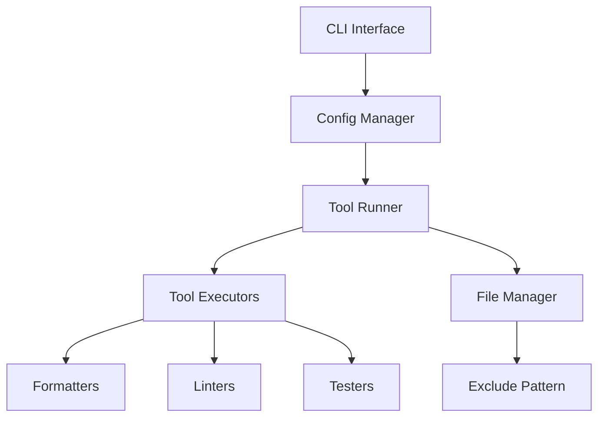

# システムパターン: pyfltr

## アーキテクチャ概要

### コアコンポーネント

## 主要モジュール

### コマンドライン処理

- 引数のパース
- コマンドの選択と実行
- 終了コードの制御

### 設定管理

- pyproject.tomlの読み込み
- 各ツールの設定統合
- 除外パターンの管理

### ファイル管理

- 対象ファイルの検索
- 除外パターンの適用
- パス解決

### ツール実行

- 各ツールの実行制御
- 並行処理の管理
- エラーハンドリング

## 設計原則

### シンプルさ

- 最小限の抽象化
- 直接的な実装
- 明確な責任分担

### 拡張性

- ツール追加が容易な設計
- 設定の柔軟な拡張
- モジュール間の疎結合

### 信頼性

- エラーの適切な処理
- 一貫した動作
- 堅牢な実行制御

## データフロー

### 設定の流れ

1. pyproject.toml読み込み
2. コマンドライン引数との統合
3. 各ツールへの設定伝播

### 実行の流れ

1. 対象ファイルの特定
2. ツールの選択
3. 実行順序の決定
4. 並行実行の制御
5. 結果の集約

## エラー処理

### 基本方針

- 明確なエラーメッセージ
- 適切な終了コード
- 実行継続可能なエラーの処理

### 重要なエラーケース

- 設定ファイルの問題
- ツール実行の失敗
- ファイルアクセスエラー
- 並行処理の問題

## パフォーマンス最適化

### 並行処理

- 適切なツールの並行実行
- ファイル処理の効率化
- リソース使用の最適化

### キャッシュ戦略

- 最小限のファイル読み込み
- 効率的なパターンマッチング
- メモリ使用の最適化

## テスト戦略

### ユニットテスト

- コアロジックのテスト
- エラーケースの検証
- 設定処理の確認

### 統合テスト

- ツール連携の検証
- エンドツーエンドの確認
- CI環境での動作確認
